---
## Front matter
lang: ru-RU
title: Лабораторная работа №1
subtitle: Операционные системы
author:
  - Серебрякова Д. И.
institute:
  - Российский университет дружбы народов, Москва, Россия
date: 4 марта 2025

## i18n babel
babel-lang: russian
babel-otherlangs: english

## Formatting pdf
toc: false
toc-title: Содержание
slide_level: 2
aspectratio: 169
section-titles: true
theme: metropolis
header-includes:
 - \metroset{progressbar=frametitle,sectionpage=progressbar,numbering=fraction}
---

## Цель работы

Целью данной работы является приобретение практических навыков установки операционной системы на виртуальную машину, настройки минимально необходимых для дальнейшей работы сервисов

## Задания

1. Создать виртуальную машину
2. Установить операционную систему

## Создание виртуальной машины

Открываю виртуальную машину, нажимаю кнопку создать и задаю первые параметры для новый виртуальной машины (рис. 1).

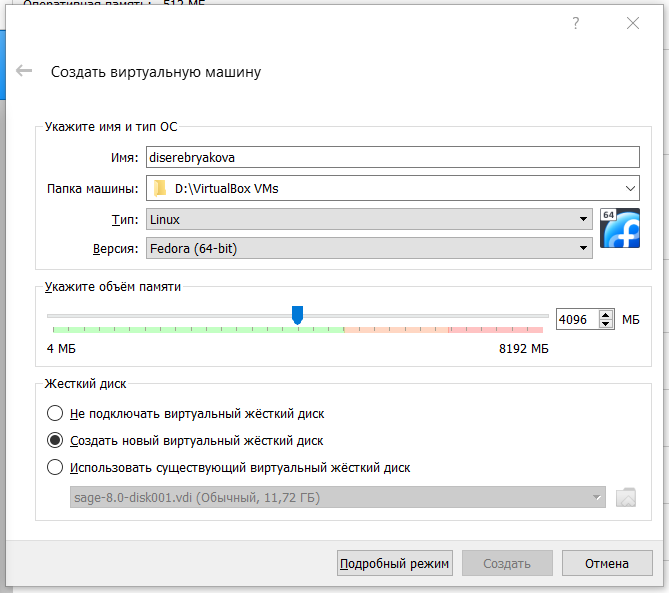{#fig:001 width=50%}

## Создание виртуальной машины

Указываю обьем основной памяти (рис. 2).

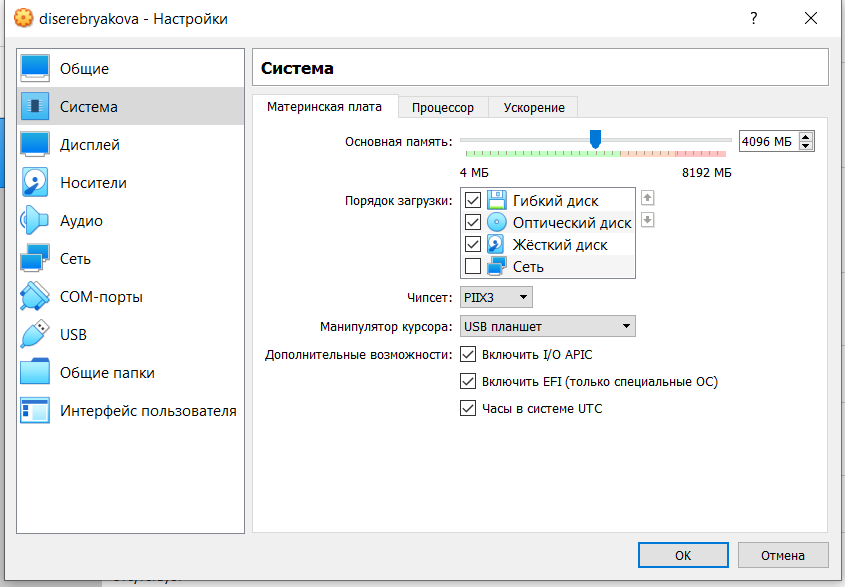{#fig:002 width=50%}

## Создание виртуальной машины

Подключаю двунаправленный буфер обмена (рис. 3).

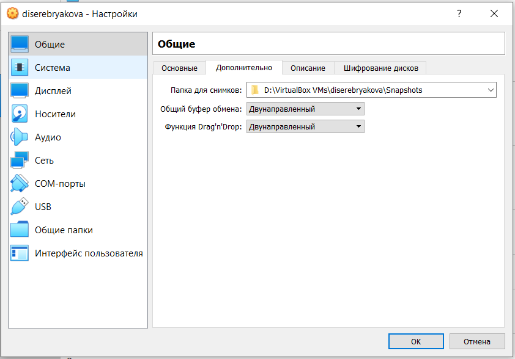{#fig:003 width=50%}

## Создание виртуальной машины

Задаю параметры видеопамяти и включаю 3D ускорение (рис. 4).

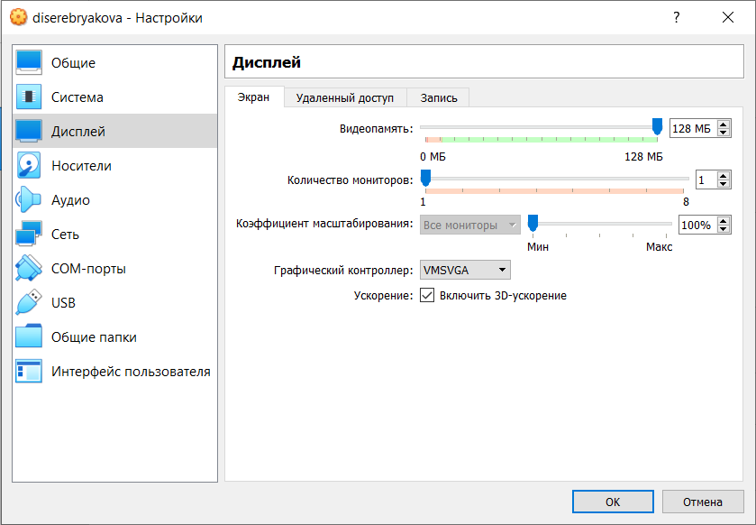{#fig:004 width=50%}

## Создание виртуальной машины

Выбираю скачанный образ ОС (рис. 5).

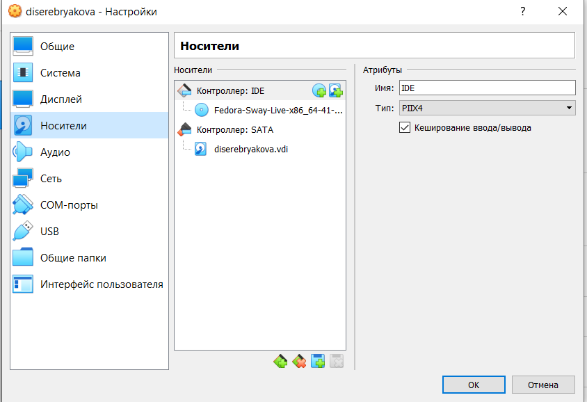{#fig:005 width=50%}

## Установка операционной системы

Запускаю виртуальную машину (рис. 6).

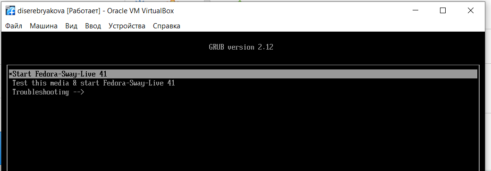{#fig:006 width=50%}

## Установка операционной системы

Вижу начальный интерфейс и следую инструкции, чтбы открыть терминал (рис. 7).

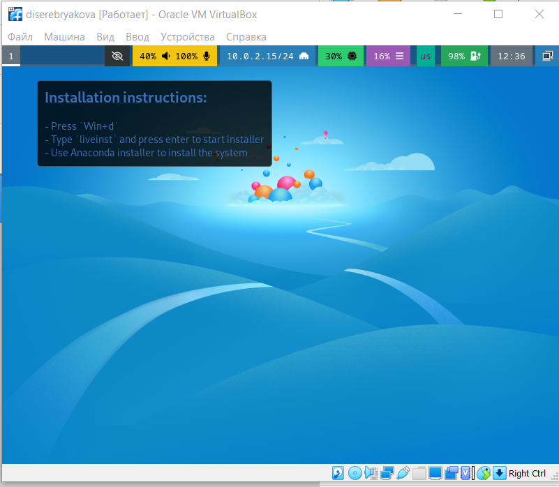{#fig:007 width=50%}

## Установка операционной системы

Устанавливаю федору (рис. 8).

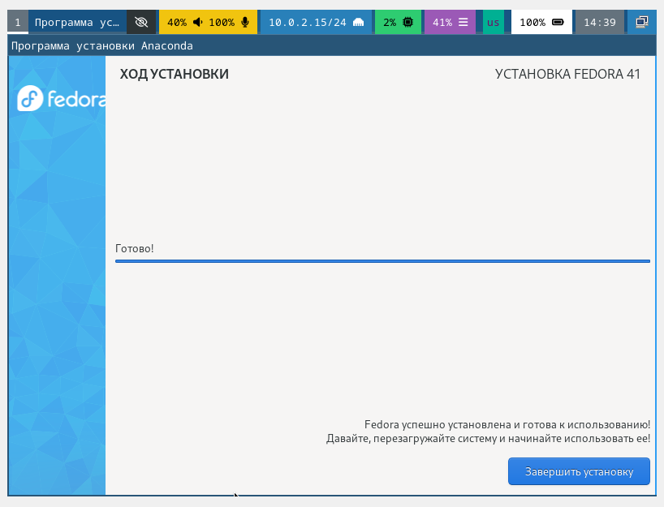{#fig:008 width=50%}

выключаю машину, отключаю носитель информации с образом ОС и включаю виртуальную машину повторно. Вхожу с паролем (рис. 10).

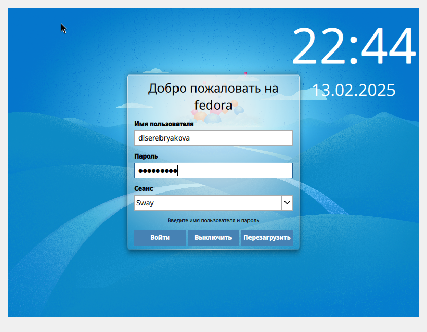{#fig:010 width=50%}

## Работа с ОС после установки

Открываю терминал, переключаюсь на роль супер пользователя (рис. 11).

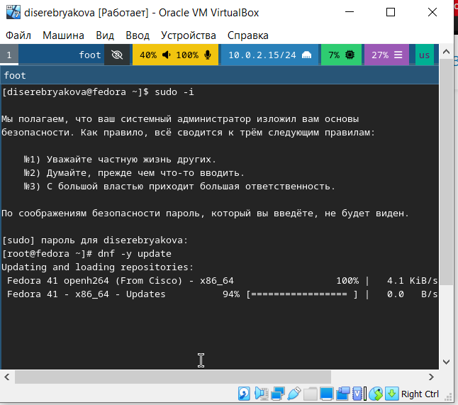{#fig:011 width=50%}

## Работа с ОС после установки

Устанавливаю программы для удобства работы в консоли (рис. 12).

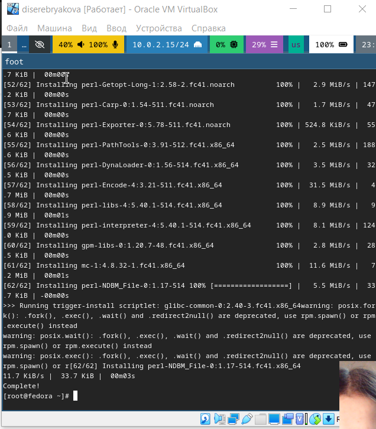{#fig:012 width=50%}

## Работа с ОС после установки

Устанавливаю программы для автоматического обновления (рис. 13).

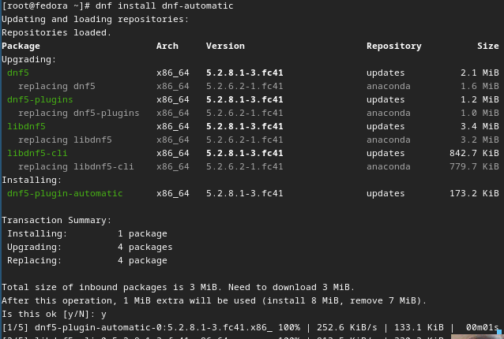{#fig:013 width=50%}

## Работа с ОС после установки

Запускаю таймер (рис. 14).

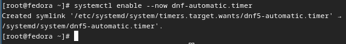{#fig:014 width=50%}

## Работа с ОС после установки

Изменяю открытый файл: меняю значение SELINUX=enforsing на SELINUX=permissive (рис. 15).

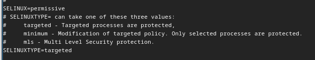{#fig:015 width=50%}

## Работа с ОС после установки

Редактирую конфигурационный файл (рис. 18).

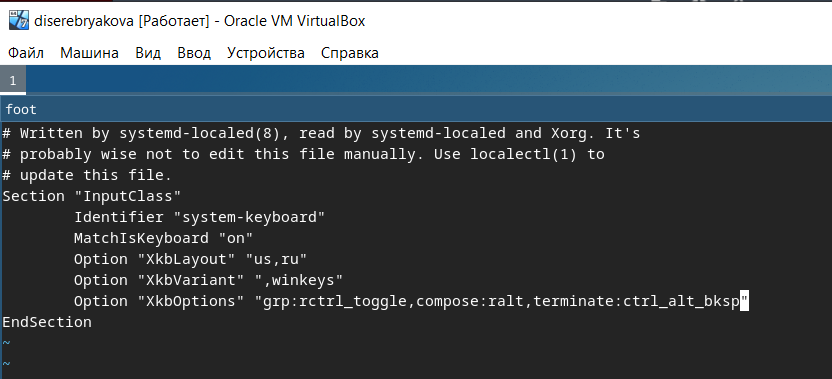{#fig:018 width=50%}

## Установка программного обеспечения для создания документации

Скачиваю пандок и пандок кросреф одинаковых версий (рис. 21).

{#fig:021 width=60%}

## Установка программного обеспечения для создания документации

Распаковываю их и устанавливаю (рис. 23).

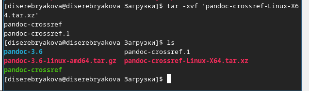{#fig:023 width=50%}

## Домашнее задание

 (рис. 25).

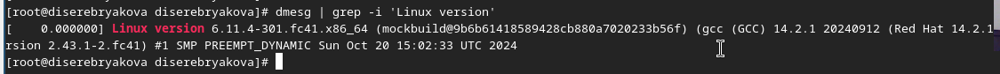{#fig:025 width=70%}

## Домашнее задание

 (рис. 26).

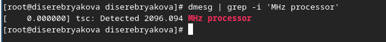{#fig:026 width=70%}

## Домашнее задание

 (рис. 27).

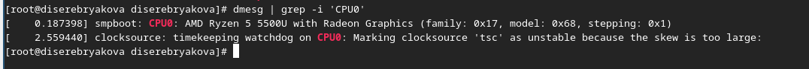{#fig:027 width=70%}

## Домашнее задание

 (рис. 28).

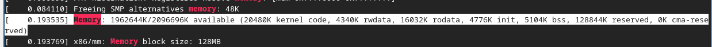{#fig:028 width=70%}

## Домашнее задание

 (рис. 29).

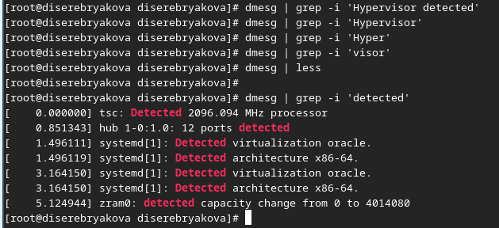{#fig:029 width=70%}

## Домашнее задание

 (рис. 30).

{#fig:030 width=70%}

## Домашнее задание

 (рис. 31).

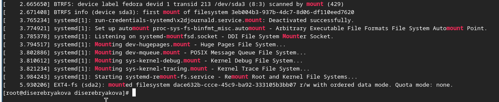{#fig:031 width=70%}

## Список литературы

1. Dash P. Getting started with oracle vm virtualbox. Packt Publishing Ltd, 2013. 86 p.
Colvin H. Virtualbox: An ultimate guide book on virtualization with virtualbox. CreateSpace 
2. Independent Publishing Platform, 2015. 70 p.
van Vugt S. Red hat rhcsa/rhce 7 cert guide : Red hat enterprise linux 7 (ex200 and ex300). 
Pearson IT Certification, 2016. 1008 p.
3. Робачевский А., Немнюгин С., Стесик О. Операционная система unix. 2-е изд. Санкт-Петербург: БХВ-Петербург, 2010. 656 p.

