---
## Front matter
title: "Отчет по лабораторной работе №1"
subtitle: "Операционные системы"
author: "Серебрякова Дарья Ильинична"

## Generic otions
lang: ru-RU
toc-title: "Содержание"

## Bibliography
bibliography: bib/cite.bib
csl: pandoc/csl/gost-r-7-0-5-2008-numeric.csl

## Pdf output format
toc: true # Table of contents
toc-depth: 2
lof: true # List of figures
lot: true # List of tables
fontsize: 12pt
linestretch: 1.5
papersize: a4
documentclass: scrreprt
## I18n polyglossia
polyglossia-lang:
  name: russian
  options:
	- spelling=modern
	- babelshorthands=true
polyglossia-otherlangs:
  name: english
## I18n babel
babel-lang: russian
babel-otherlangs: english
## Fonts
mainfont: IBM Plex Serif
romanfont: IBM Plex Serif
sansfont: IBM Plex Sans
monofont: IBM Plex Mono
mathfont: STIX Two Math
mainfontoptions: Ligatures=Common,Ligatures=TeX,Scale=0.94
romanfontoptions: Ligatures=Common,Ligatures=TeX,Scale=0.94
sansfontoptions: Ligatures=Common,Ligatures=TeX,Scale=MatchLowercase,Scale=0.94
monofontoptions: Scale=MatchLowercase,Scale=0.94,FakeStretch=0.9
mathfontoptions:
## Biblatex
biblatex: true
biblio-style: "gost-numeric"
biblatexoptions:
  - parentracker=true
  - backend=biber
  - hyperref=auto
  - language=auto
  - autolang=other*
  - citestyle=gost-numeric
## Pandoc-crossref LaTeX customization
figureTitle: "Рис."
tableTitle: "Таблица"
listingTitle: "Листинг"
lofTitle: "Список иллюстраций"
lotTitle: "Список таблиц"
lolTitle: "Листинги"
## Misc options
indent: true
header-includes:
  - \usepackage{indentfirst}
  - \usepackage{float} # keep figures where there are in the text
  - \floatplacement{figure}{H} # keep figures where there are in the text
---

# Цель работы

Целью данной работы является приобретение практических навыков установки операционной системы на виртуальную машину, настройки минимально необходимых для дальнейшей работы сервисов

# Задание

1. Создать виртуальную машину
2. Установить операционную систему

# Выполнение лабораторной работы

## Создание виртуальной машины

Открываю виртуальную машину, нажимаю кнопку создать и задаю первые параметры для новый виртуальной машины (рис. [-@fig:001]).

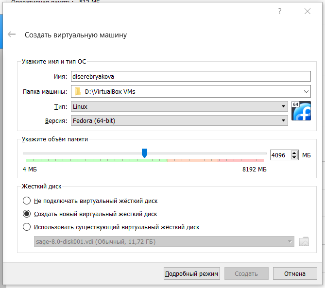{#fig:001 width=70%}

Указываю обьем основной памяти (рис. [-@fig:002]).

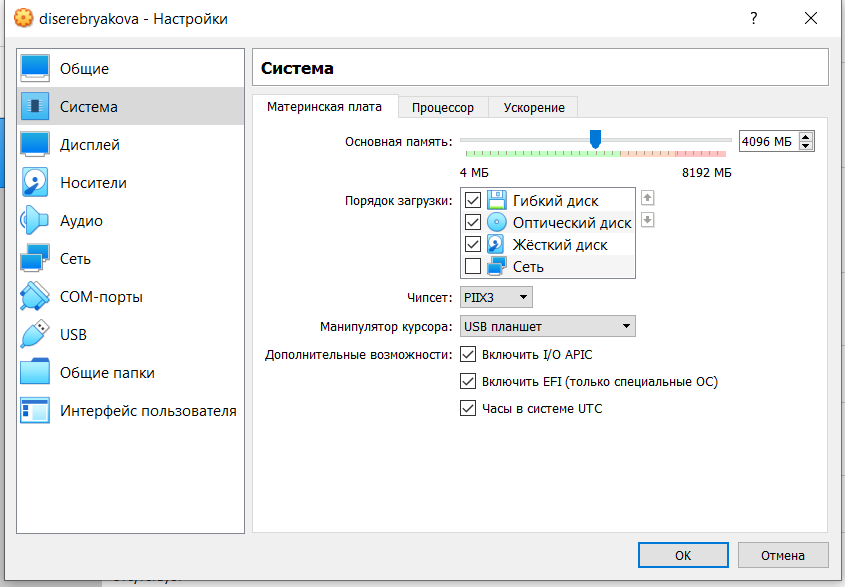{#fig:002 width=70%}

Подключаю двунаправленный буфер обмена (рис. [-@fig:003]).

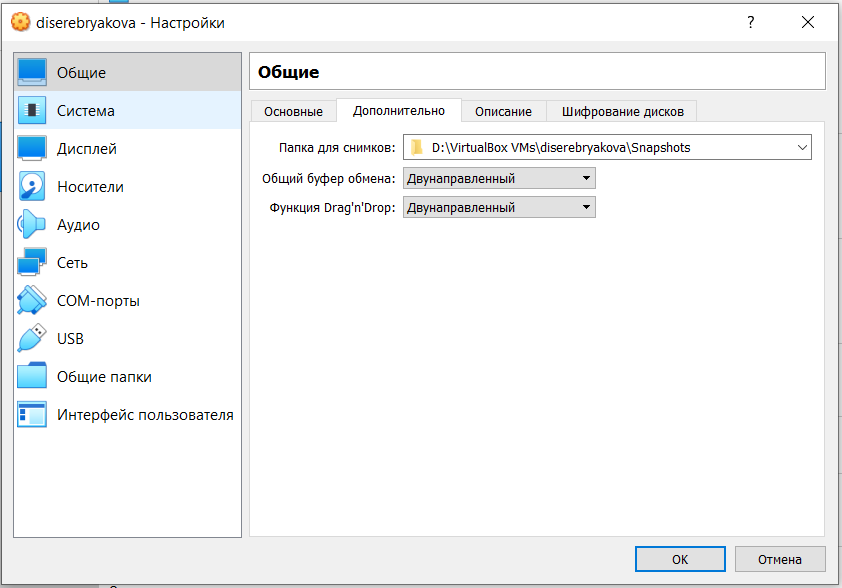{#fig:003 width=70%}

Задаю параметры видеопамяти и включаю 3D ускорение (рис. [-@fig:004]).

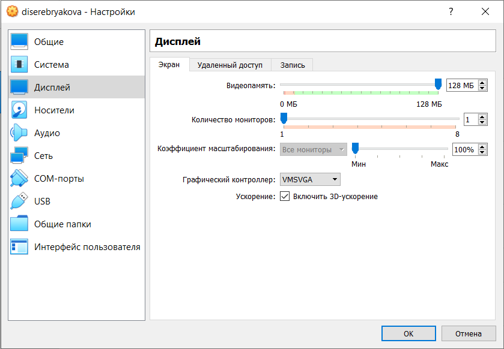{#fig:004 width=70%}

Выбираю скачанный образ ОС (рис. [-@fig:005]).

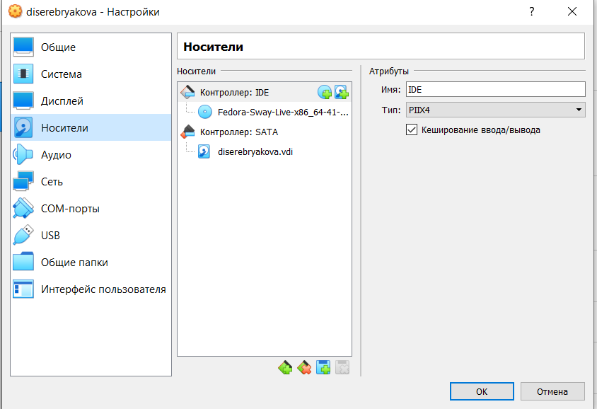{#fig:005 width=70%}

##Установка операционной системы

Запускаю виртуальную машину (рис. [-@fig:006]).

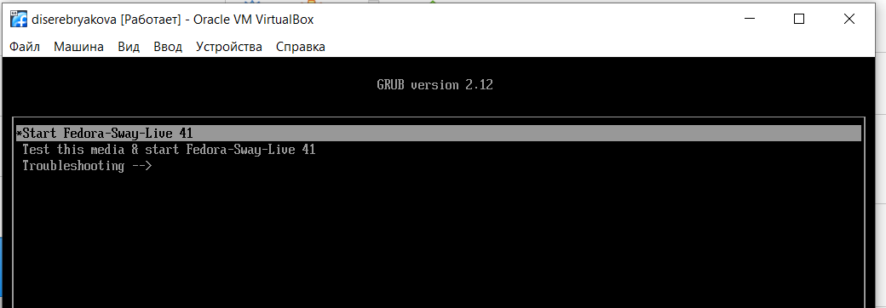{#fig:006 width=70%}

Вижу начальный интерфейс и следую инструкции, чтбы открыть терминал (рис. [-@fig:007]).

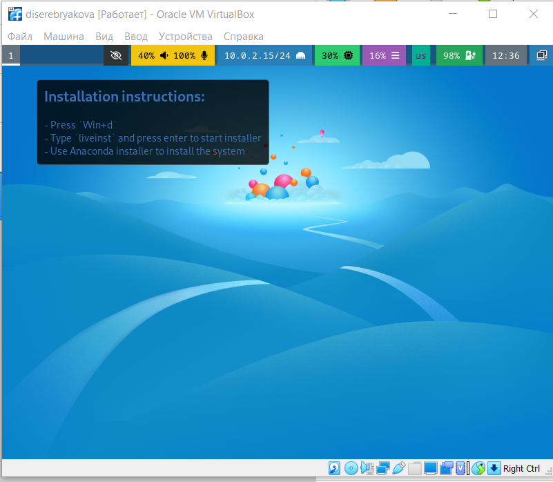{#fig:007 width=70%}

Устанавливаю федору (рис. [-@fig:008]).

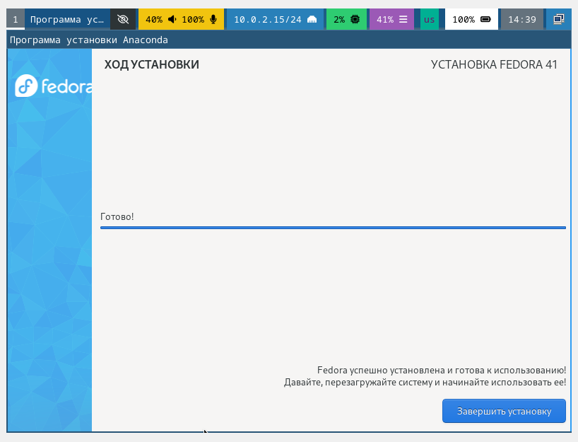{#fig:008 width=70%}

выключаю машину, отключаю носитель информации с образом ОС и включаю виртуальную машину повторно. Вхожу с паролем (рис. [-@fig:010]).

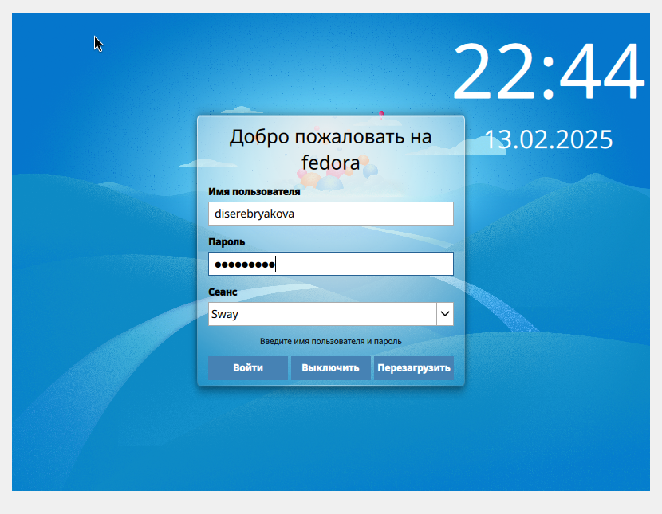{#fig:010 width=70%}

## Работа с ОС после установки

Открываю терминал, переключаюсь на роль супер пользователя (рис. [-@fig:011]).

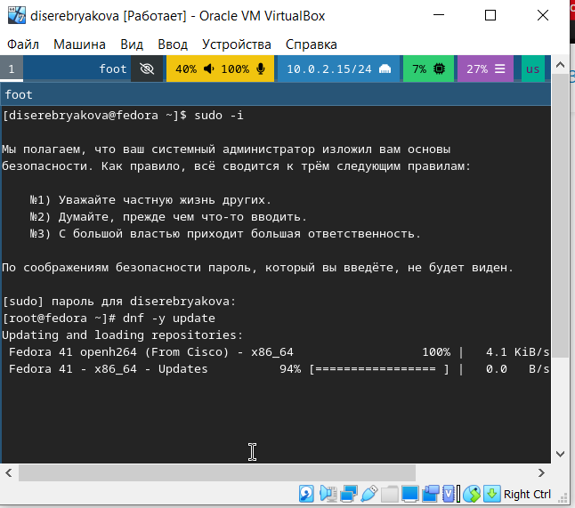{#fig:011 width=70%}

Устанавливаю программы для удобства работы в консоли (рис. [-@fig:012]).

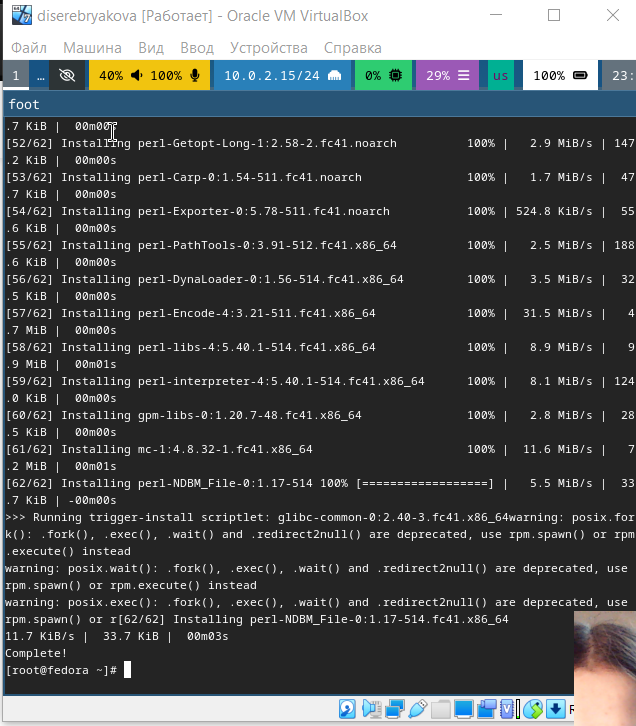{#fig:012 width=70%}

Устанавливаю программы для автоматического обновления (рис. [-@fig:013]).

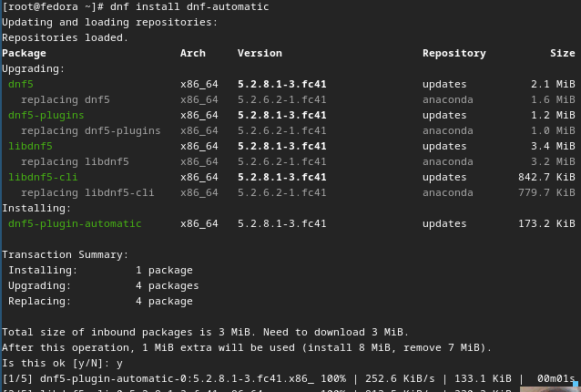{#fig:013 width=70%}

Запускаю таймер (рис. [-@fig:014]).

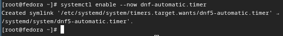{#fig:014 width=70%}

Изменяю открытый файл: меняю значение SELINUX=enforsing на SELINUX=permissive (рис. [-@fig:015]).

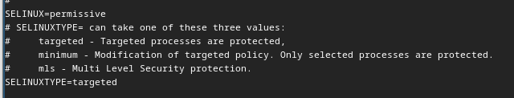{#fig:015 width=70%}

Редактирую конфигурационный файл (рис. [-@fig:018]).

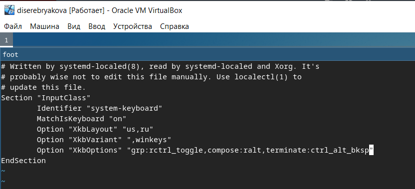{#fig:018 width=70%}

## Установка программного обеспечения для создания документации

Скачиваю пандок и пандок кросреф одинаковых версий (рис. [-@fig:021]).

{#fig:021 width=70%}

Распаковываю их и устанавливаю (рис. [-@fig:023]).

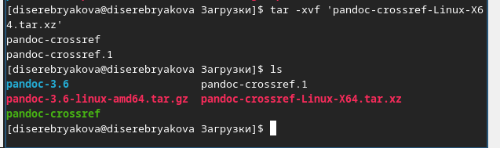{#fig:023 width=70%}

## Домашнее задание

 (рис. [-@fig:025]).

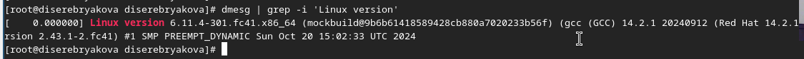{#fig:025 width=70%}

 (рис. [-@fig:026]).

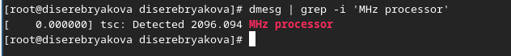{#fig:026 width=70%}

 (рис. [-@fig:027]).

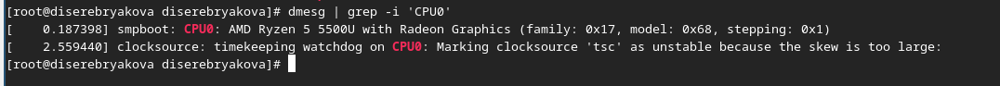{#fig:027 width=70%}

 (рис. [-@fig:028]).

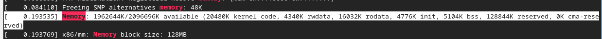{#fig:028 width=70%}

 (рис. [-@fig:029]).

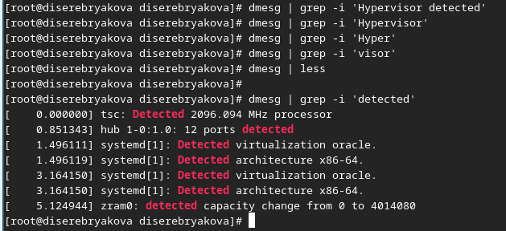{#fig:029 width=70%}

 (рис. [-@fig:030]).

{#fig:030 width=70%}

 (рис. [-@fig:031]).

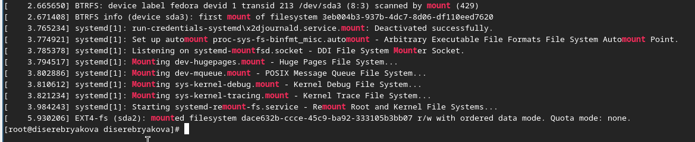{#fig:031 width=70%}

## Ответы на вопросы

1. Учетная запись содержит необходимые для идентификации пользователя при подключении к системе данные, а так же информацию для авторизации и учета: системного имени (user name) (оно может содержать только латинские буквы и знак нижнее подчеркивание, еще оно должно быть уникальным), идентификатор пользователя (UID) (уникальный идентификатор пользователя в системе, целое положительное число), идентификатор группы (CID) (группа, к к-рой относится пользователь. Она, как минимум, одна, по умолчанию - одна), полное имя (full name) (Могут быть ФИО), домашний каталог (home directory) (каталог, в к-рый попадает пользователь после входа в систему и в к-ром хранятся его данные), начальная оболочка (login shell) (командная оболочка, к-рая запускается при входе в систему)

2. Для получения справки по команде: <команда> --help; для перемещения по файловой системе - cd; для просмотра содержимого каталога - ls; для определения объёма каталога - du <имя каталога>; для создания / удаления каталогов - mkdir/rmdir; для создания / удаления файлов - touch/rm; для задания определённых прав на файл / каталог - chmod; для просмотра истории команд - history

3. Файловая система - это порядок, определяющий способ организации и хранения и именования данных на различных носителях информации. Примеры: FAT32 представляет собой пространство, разделенное на три части: олна область для служебных структур, форма указателей в виде таблиц и зона для хранения самих файлов. ext3/ext4 - журналируемая файловая система, используемая в основном в ОС с ядром Linux

4. С помощью команды df, введя ее в терминале. Это утилита, которая показывает список всех файловых систем по именам устройств, сообщает их размер и данные о памяти. Также посмотреть подмонтированные файловые системы можно с помощью утилиты mount

5. Чтобы удалить зависший процесс, вначале мы должны узнать, какой у него id: используем команду ps. Далее в терминале вводим команду kill < id процесса >. Или можно использовать утилиту killall, что "убьет" все процессы, которые есть в данный момент, для этого не нужно знать id процесса

# Выводы

При выполнении данной лабораторной работы я приобрела практические навыки установки операционной системы на виртуальную машину

# Список литературы

1. Dash P. Getting started with oracle vm virtualbox. Packt Publishing Ltd, 2013. 86 p.
Colvin H. Virtualbox: An ultimate guide book on virtualization with virtualbox. CreateSpace 
2. Independent Publishing Platform, 2015. 70 p.
van Vugt S. Red hat rhcsa/rhce 7 cert guide : Red hat enterprise linux 7 (ex200 and ex300). 
Pearson IT Certification, 2016. 1008 p.
3. Робачевский А., Немнюгин С., Стесик О. Операционная система unix. 2-е изд. Санкт-Петербург: БХВ-Петербург, 2010. 656 p.
