---
## Front matter
lang: ru-RU
title: Лабораторная работа №2
subtitle: Операционные системы
author:
  - Серебрякова Д. И.
institute:
  - Российский университет дружбы народов, Москва, Россия
date: 4 марта 2025

## i18n babel
babel-lang: russian
babel-otherlangs: english

## Formatting pdf
toc: false
toc-title: Содержание
slide_level: 2
aspectratio: 169
section-titles: true
theme: metropolis
header-includes:
 - \metroset{progressbar=frametitle,sectionpage=progressbar,numbering=fraction}
---

## Цель работы

Цель данной работы - изучение идеологии и применения средств контроля версий, освоение умения работы с git

## Задание

1. Создать базовую конфигурацию для работы с git
2. создать ключи SSH и GPG
3. Создать локальный каталог для выполнения заданий по предмету

## Настройка git

Устанавливаю необходиммое программное обеспечение. Задаю в качестве имени и адреса почты владельца репозитория свои данные (рис. 1).

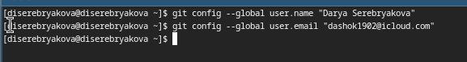{#fig:001 width=50%}

## Настройка git

Настраиваю utf-8 в выводе сообщений гит для их корректного отображения (рис. 2).

{#fig:002 width=50%}

## Создание ключа SSH

Создаю ключ ssh размером 4096 бит по алгоритму rsa (рис. 5).

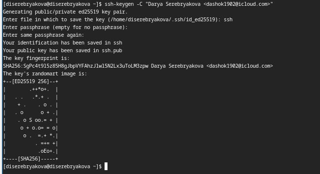{#fig:005 width=50%}

## Создание ключа SSH

Ключ создан (рис. 6).

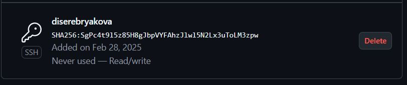{#fig:006 width=50%}

## Создание ключа GPG

Генерирую ключ gpg, затем выбираю тип ключа, задаю максимальную его длину и ставлю неограниченный срок действия ключа (рис. 7).

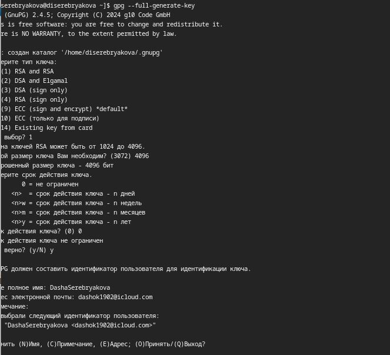{#fig:007 width=50%}

## Добавление ключа GPG в гитхаб

Выыожу список созданных ключей в терминал, копирую в буфер обмена отпечаток ключа (рис. 8).

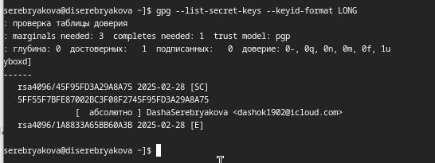{#fig:008 width=50%}

## Добавление ключа GPG в гитхаб

Ввожу в терминале команду, с помощью которой копирую сам ключ в буфер обмена (рис. 9).

{#fig:009 width=50%}

## Добавление ключа GPG в гитхаб

Ключ создан (рис. 10).

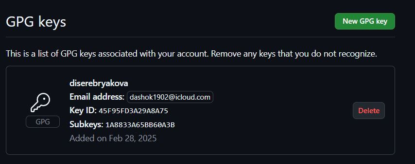{#fig:010 width=50%}

## Настройка подписи git

Настраиваю автоматические подписи коммитов гит (рис. 11).

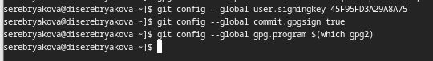{#fig:011 width=50%}

## Настройка gh

Начинаю авторизацию в gh, авторизируюсь через браузер (рис. 12).

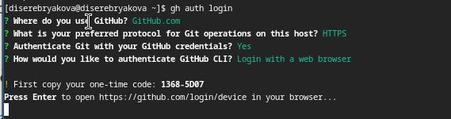{#fig:012 width=70%}

## Настройка gh

Авторизация успешно выполнена (рис. 13).

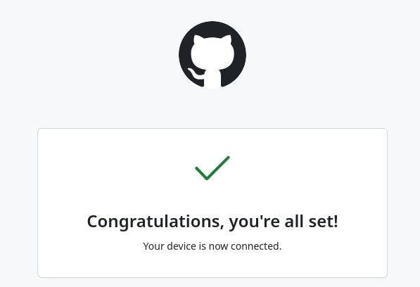{#fig:013 width=70%}

## Настройка gh

Вижу сообщение об окончании авторизации под именем dserebryakova (рис. 14).

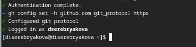{#fig:014 width=70%}

## Создание репозитория курса на основе шаблона 

Создаю директорию, перехожу в нее, создаю репозиторий на основе шаблона репозитория и клонирую его к себе в директорию (рис. 15).

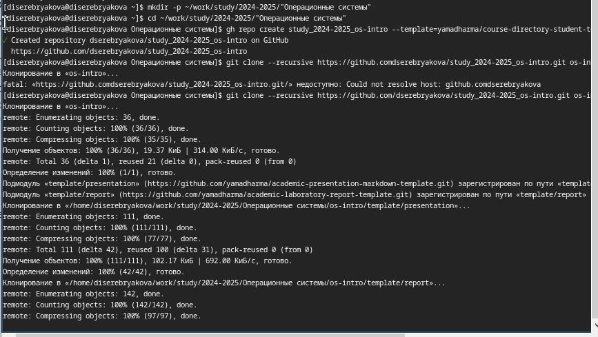{#fig:015 width=70%}

## Создание репозитория курса на основе шаблона 

Перехожу в каталог курса, удаляю лишние файлы и создаю необходимые каталоги (рис. 16).

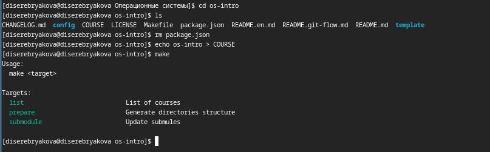{#fig:016 width=70%}

## Создание репозитория курса на основе шаблона 

Добавляю все новые файлы и отправляю их на сервер (рис. 17).

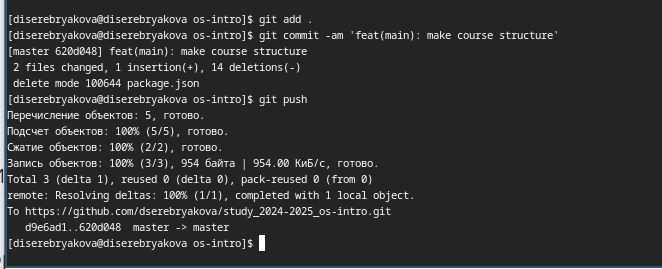{#fig:017 width=70%}

## Выводы

При выполнении данной работы я изучила идеологию и применение средств контроля версий, освоила работу с git

## Список литературы

1. Лабораторная работа №2

