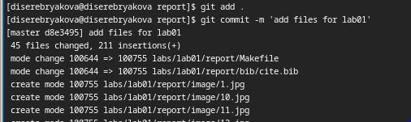
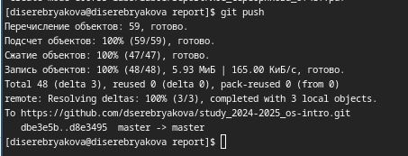
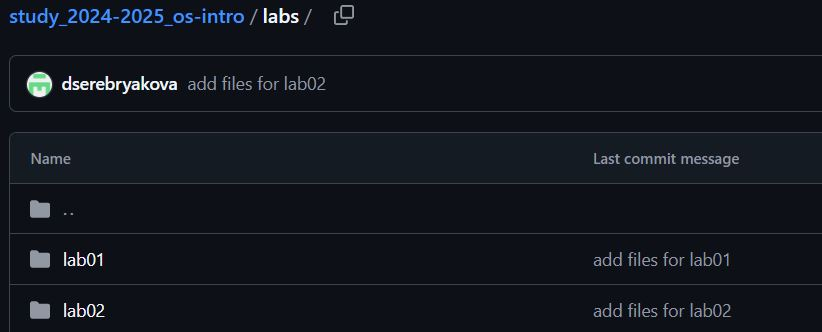

---
## Front matter
lang: ru-RU
title: Лабораторная работа №3
subtitle: Операционные системы
author:
  - Серебрякова Д. И.
institute:
  - Российский университет дружбы народов, Москва, Россия
date: 6 марта 2025

## i18n babel
babel-lang: russian
babel-otherlangs: english

## Formatting pdf
toc: false
toc-title: Содержание
slide_level: 2
aspectratio: 169
section-titles: true
theme: metropolis
header-includes:
 - \metroset{progressbar=frametitle,sectionpage=progressbar,numbering=fraction}
---

## Цель работы

Натренировать навыки работы с markdown

## Задание

1. Выполнить отчеты по лабораторным работам 1 и 2

## Выполнение лабораторной работы

Выполнила отчеты по лабораторным работам  добавила к ним подписи для коммита (рис. 1).

{#fig:001 width=50%}

## Выполнение лабораторной работы

Отправила все подписанные файлы на гитхаб (рис. 2).

{#fig:002 width=50%}

## Выполнение лабораторной работы

Убедилась, что все файлы подгрузились в гитхаб (рис. 4).

{#fig:004 width=70%}

## Выводы

Вспомнила, как работать с markdown

## Список литературы

1. Лабораторная работа №2

