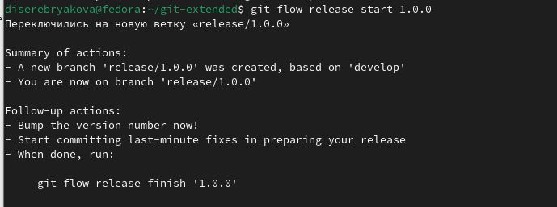

---
## Front matter
lang: ru-RU
title: Лабораторная работа №4
subtitle: Операционные системы
author:
  - еребрякова Д. И.
institute:
  - Российский университет дружбы народов, Москва, Россия
date: 5 марта 2025

## i18n babel
babel-lang: russian
babel-otherlangs: english

## Formatting pdf
toc: false
toc-title: Содержание
slide_level: 2
aspectratio: 169
section-titles: true
theme: metropolis
header-includes:
 - \metroset{progressbar=frametitle,sectionpage=progressbar,numbering=fraction}
---

## Цель работы

Получение навыков правильной работы с репозиториями git

## Задания

1. Выполнить работу для тестового репозитория
2. Преобразовать рабочий репозиторий в репозиторий с git-flow и conventional commits

# Выполнение лабораторной работы

## Установка git-flow

Включаю copr репозиторий (рис. 1).

{#fig:001 width=50%}

## Установка git-flow

Устанавливаю gitflow (рис. 2).

{#fig:002 width=50%}

## Установка Node.js

Перехожу на роль суперпользователя (3).

{#fig:003 width=50%}

## Установка Node.js

Устанавливаю nodejs и pnpm (рис. 4).

{#fig:004 width=50%}

## Установка Node.js

Запускаю pnpm (рис. 5).

{#fig:005 width=50%}

## Практический сценарий использования git

Создаю новый репозиторий (рис. 6).

{#fig:006 width=50%}

## Практический сценарий использования git

Сделала к нему первый коммит и выкладываю на гитхаб (рис. 7).

{#fig:007 width=50%}

## Практический сценарий использования git

Редактирую файл package.json  (рис. 8).

{#fig:008 width=50%}

## Практический сценарий использования git

Добавила новые файлы, выполнила коммит и отправила на гитхаб  (рис. 9).

{#fig:009 width=50%}

## Конфигурация git-flow

Инициализировала git-flow, проверяю, в какой ветке нахожусь и загружаю весь репозиторий в хранилище  (рис. 10).

{#fig:010 width=50%}

## Конфигурация git-flow

Создаю релиз с версией 1.0.0 (рис. 11).

{#fig:011 width=50%}

## Конфигурация git-flow

Создаю журнал изменений (рис. 12).

{#fig:012 width=50%}

## Конфигурация git-flow

Добавляю журнал изменений в индекс, заливаю релизную ветку в основную ветку и отправляю данные на гитхаб (рис. 13).

{#fig:013 width=50%}

## Конфигурация git-flow

Выполнила вход в аккаунт гитхаб через браузер (рис. 14).

{#fig:014 width=50%}

## Работа с репозиторием git

Создаю ветку для новой функциональности (рис. 16).

{#fig:016 width=50%}

## Работа с репозиторием git

Создаю релиз с версией 1.2.3 (рис. 17).

{#fig:017 width=50%}

## Работа с репозиторием git

Выполняю те же шаги, что и для прошлого релиза и отправляю все на гитхаб (рис. 18).

{#fig:018 width=50%}

## Работа с репозиторием git

Создаю релиз на github с комментарием из журнала изменений (рис. 19).

{#fig:019 width=50%}

## Выводы

В ходе выполнения работы я получила навыки работы с репозиториями github

# Спасибо за внимание
