---
## Front matter
lang: ru-RU
title: Лабораторная работа №5
subtitle: Операционные системы
author:
  - Серебрякова Д. И.
institute:
  - Российский университет дружбы народов, Москва, Россия
date: 11 марта 2025

## i18n babel
babel-lang: russian
babel-otherlangs: english

## Formatting pdf
toc: false
toc-title: Содержание
slide_level: 2
aspectratio: 169
section-titles: true
theme: metropolis
header-includes:
 - \metroset{progressbar=frametitle,sectionpage=progressbar,numbering=fraction}
---

## Цель работы

Познакомиться с pass, gopass, chezmoi, научиться ими пользоваться

## Задания

1. Установить дополнительное ПО
2. Установить и настроить pass
3. Настроить интерфейс с браузером
4. Установить и настроить chezmoi

# Выполнение лабораторной работы

## Установка и настройка менеджера паролей pass

Перешла в режим суперпользователя и начинаю установку pass (рис. 1).

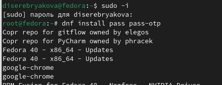{#fig:001 width=70%}

## Установка и настройка менеджера паролей pass

Устанавливаю gopass (рис. 2).

{#fig:002 width=70%}

## Установка и настройка менеджера паролей pass

Просматриваю список ключей и создаю новый (рис. 3).

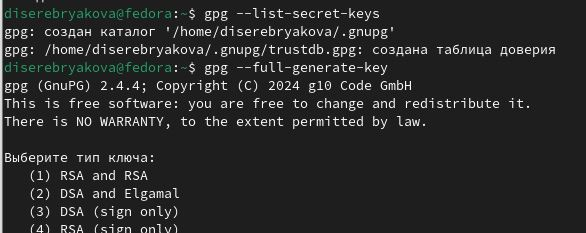{#fig:003 width=70%}

## Установка и настройка менеджера паролей pass

Инициализирую хранилище, синхронизирую с гит и создаю структуру гит (рис. 4).

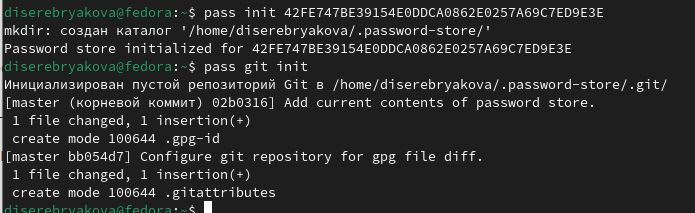{#fig:004 width=70%}

## Настройка интерфейса с броузером

Устанавливаю программу, обеспечивающую интерфейс native messaging (рис. 5).

{#fig:005 width=70%}

## Сохранение пароля

Созддаю файл с паролем (рис. 6).

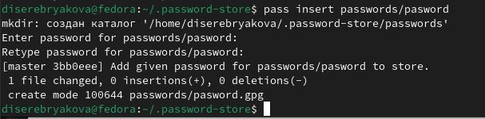{#fig:006 width=70%}

## Сохранение пароля

Отображаю созданный пароль (рис. 7).

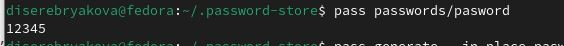{#fig:007 width=70%}

## Сохранение пароля

Заменяю пароль на сгенерированный автоматически (рис. 8).

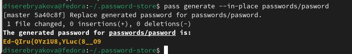{#fig:008 width=70%}

## Управление файлами конфигурации

Устанавливаю дополнительное программное обеспечение (рис. 9).

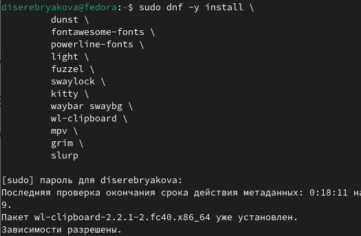{#fig:009 width=70%}

## Управление файлами конфигурации

Устанавливаю шрифты (рис. 10).

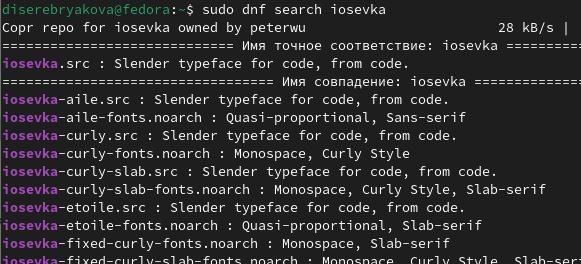{#fig:010 width=70%}

## Управление файлами конфигурации

Устанавливаю шрифты (рис. 11).

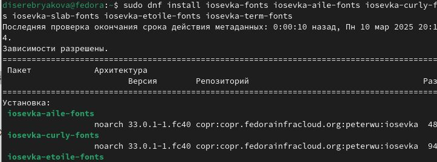{#fig:011 width=70%}

## Управление файлами конфигурации

Устанавливаю бинарный файл и создаю собственный репозиторий с помощью утилит (рис. 12).

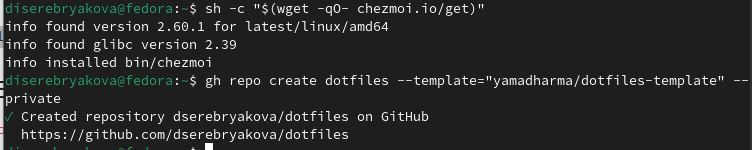{#fig:012 width=70%}

## Использование chezmoi на нескольких машинах

На второй машине инициализирую chezmoi с моим репозиторием dotfiles (рис. 13).

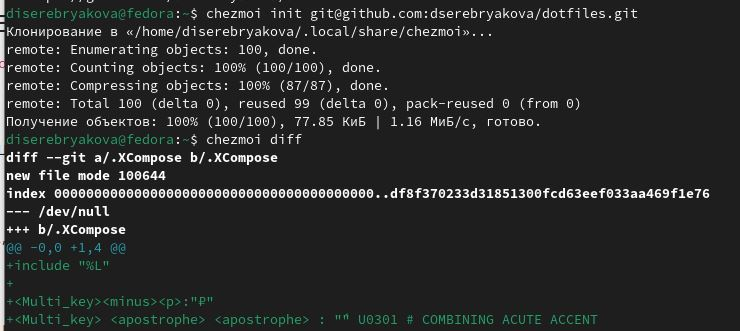{#fig:013 width=70%}

## Использование chezmoi на нескольких машинах

Проверяю, какие изменения вносятся в домашний каталог и сохраняю их (рис. 14).

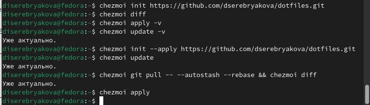{#fig:014 width=70%}

## Использование chezmoi на нескольких машинах

Чтобы включить автоматическую фиксацию и отправлять изменения в исходный каталог в репозиторий, добавляю в файл конфигурации ~/.config/chezmoi/chezmoi.toml следующие строки (рис. 15).

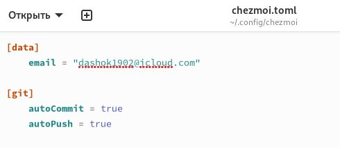{#fig:015 width=70%}

## Выводы

В ходе выполнения работы я познакомилась с pass, gopass, chezmoi, научилась ими пользоваться

## Список литературы

1. Лабораторная работа 5

# Благодарю за внимание
