---
## Front matter
lang: ru-RU
title: Лабораторная работа №6
subtitle: Операционные системы
author:
  - Серебрякова Д. И.
institute:
  - Российский университет дружбы народов, Москва, Россия
date: 15 марта 2025

## i18n babel
babel-lang: russian
babel-otherlangs: english

## Formatting pdf
toc: false
toc-title: Содержание
slide_level: 2
aspectratio: 169
section-titles: true
theme: metropolis
header-includes:
 - \metroset{progressbar=frametitle,sectionpage=progressbar,numbering=fraction}
---

## Цель работы

Приобретение практических навыков взаимодействия пользователя с системой посредством командной строки

## Выполнение лабораторной работы

Определяю полное имя домашнего каталога (рис. 1).

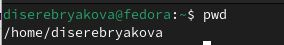{#fig:001 width=70%}

## Выполнение лабораторной работы

Перехожу в каталог tmp и вывожу его содержимое (рис. 2).

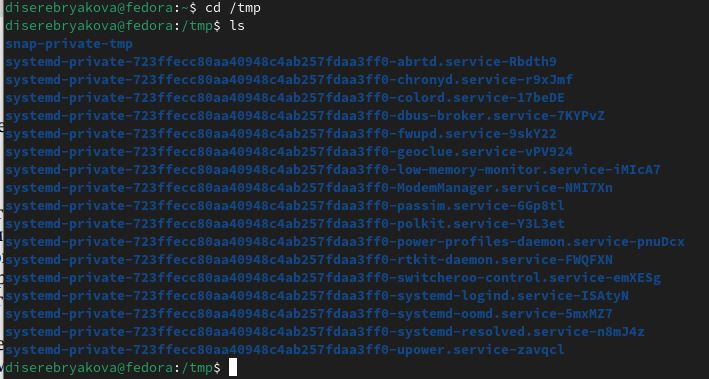{#fig:002 width=50%}

## Выполнение лабораторной работы

Просматриваю содержимое с именами скрытых файлов командой ls с опцией a (рис. 3).

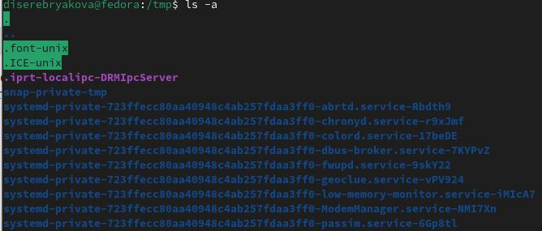{#fig:003 width=70%}

## Выполнение лабораторной работы

Вывожу содержимое вместе с подробной информацией о файлах и каталогах с помощью команды ls с опцией l (рис. 4).

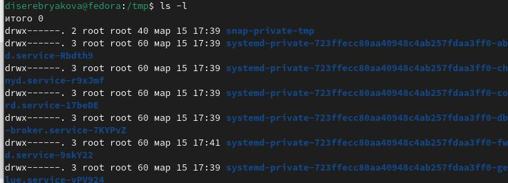{#fig:004 width=70%}

## Выполнение лабораторной работы

Вывожу подробнейшее содержимое командой ls с опцией alF (рис. 5).

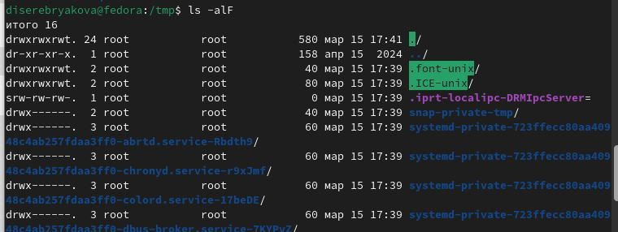{#fig:005 width=70%}

## Выполнение лабораторной работы

Проверяю, есть ли в каталоге var/spool подкаталог с именем cron. Спойлер: его там нет (рис. 6).

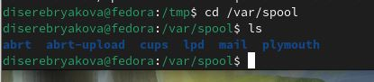{#fig:006 width=70%}

## Выполнение лабораторной работы

Перехожу в домашний каталог и вывожу его содержимое. Я сама же и являюсь владельцем данных файлов (рис. 7).

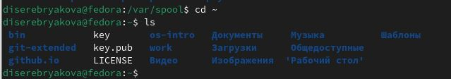{#fig:007 width=70%}

## Выполнение лабораторной работы

В домашнем каталоге создаю новый каталог с именем newdir, а в нем создала новый каталог с именем morefun (рис. 8).

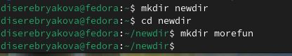{#fig:008 width=70%}

## Выполнение лабораторной работы

В домашнем каталоге создаю одной командой три новых каталога с именами
letters, memos, misk. Затем удаляю эти каталоги одной командой (рис. 9).

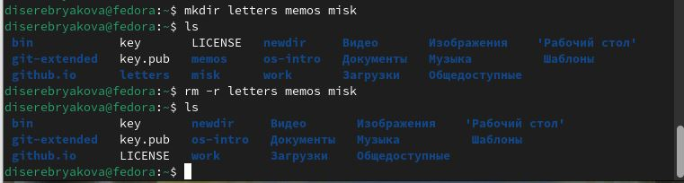{#fig:009 width=70%}

## Выполнение лабораторной работы

Пробую удалить ранее созданный каталог newdir командой rm. Не получается. Чтобы удалить каталог newdir/morefun из домашнего каталога использую команду rm с опцией r. Проверяю, что каталог был удален (рис. 10).

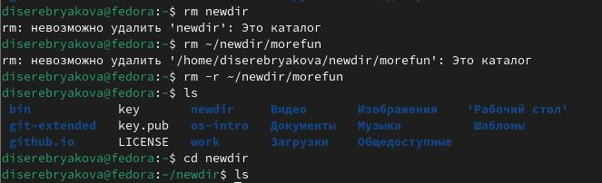{#fig:010 width=70%}

## Выполнение лабораторной работы

С помощью команды man определяю, для каких целей какую опцию команды ls удобней использовать (рис. 11).

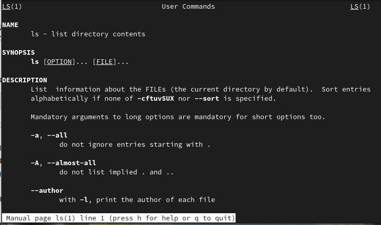{#fig:011 width=50%}

## Выполнение лабораторной работы

Использую команду man для просмотра описания следующих команд: cd, pwd, mkdir,
rmdir, rm (рис. 12).

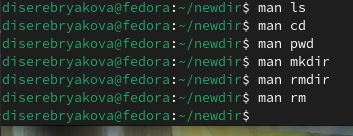{#fig:012 width=70%}

## Выполнение лабораторной работы

Просматриваю буфер команд командой history (рис. 13).

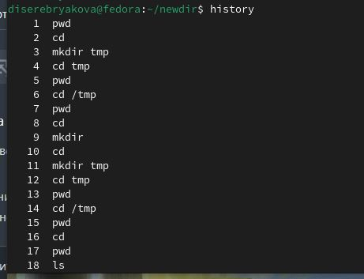{#fig:013 width=70%}

## Выполнение лабораторной работы

Пробую исполнить команду, вызвав ее по номеру. Выполняю ее модификацию (рис. 14).

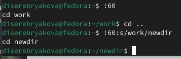{#fig:014 width=70%}

## Выполнение лабораторной работы

Пробую исполнить еще одну команду, вызвав ее по номеру. Выполняю ее модификацию (рис. 15).

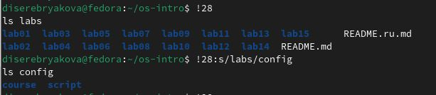{#fig:015 width=70%}

## Выводы

В ходе выполнения работы я приобрела практические навыки взаимодействия пользователя с ситемой посредством консоли

# Благодарю за внимание
