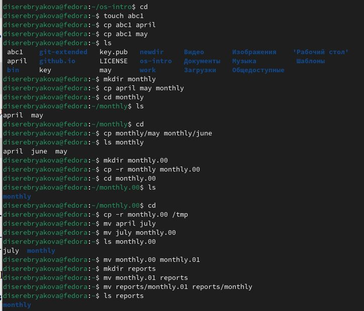
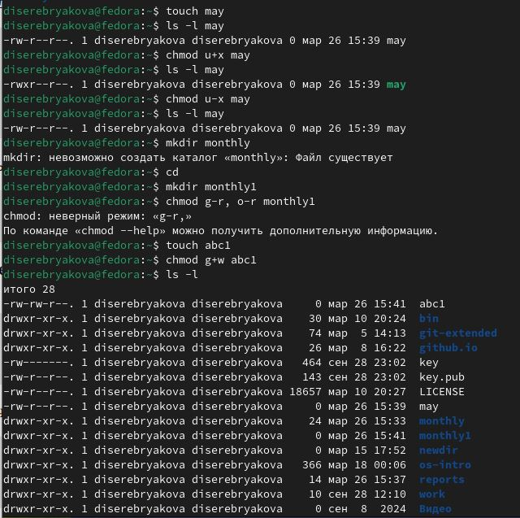
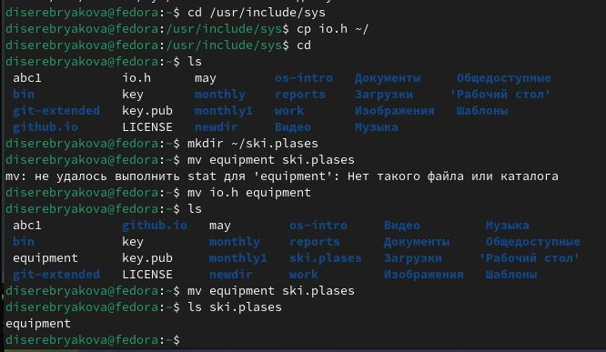
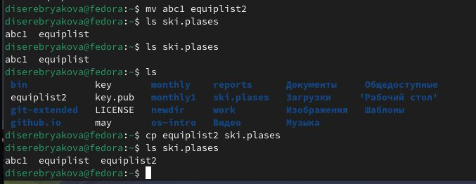
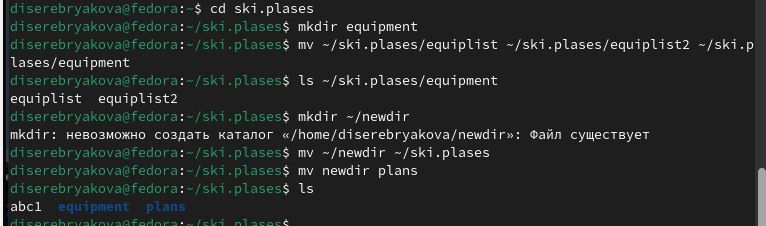
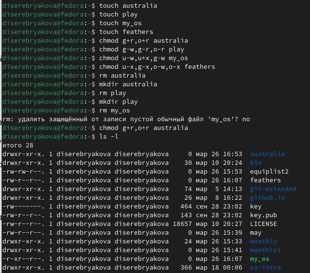
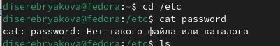
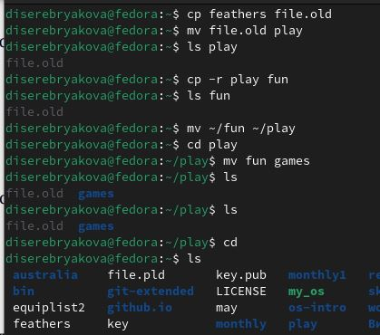
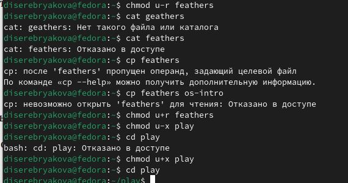
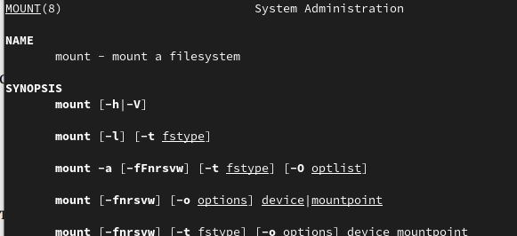

---
## Front matter
lang: ru-RU
title: Лабораторная работа №7
subtitle: Операционные системы
author:
  - Серебрякова Д. И.
institute:
  - Российский университет дружбы народов, Москва, Россия
date: 27 марта 2025

## i18n babel
babel-lang: russian
babel-otherlangs: english

## Formatting pdf
toc: false
toc-title: Содержание
slide_level: 2
aspectratio: 169
section-titles: true
theme: metropolis
header-includes:
 - \metroset{progressbar=frametitle,sectionpage=progressbar,numbering=fraction}
---

## Цель работы

Ознакомление с файловой системой Linux, её структурой, именами и содержанием
каталогов. Приобретение практических навыков по применению команд для работы
с файлами и каталогами, по управлению процессами (и работами), по проверке использования диска и обслуживанию файловой системы.

## Задания

1. Выполнить все примеры, приведённые в первой части описания лабораторной работы
2. Выполнить предложенные действия, связанные с переименованиемЮ копированием и перемещением файлов и каталогов
3. Определить опции команды chmod
4. Прочитать man по командам mount, fsck, mkfs, kill и кратко их охарактеризовать,
приведя примеры

## Выполнение лабораторной работы

Выполняю все примеры, приведенные в первой части лабораторной работы (рис. 1).

{#fig:001 width=40%}

## Выполнение лабораторной работы

Продолжаю выполнение примеров (рис. 2).

{#fig:002 width=40%}

## Выполнение лабораторной работы

Проверяю, есть ли необходимый мне файл usr/include/sys/io.h (рис. 3).

{#fig:003 width=70%}

## Выполнение лабораторной работы

Копирую файл io.h в домашний каталог и называю его equipment, а также перемещаю файл equipment в каталог ski.plases (рис. 4).

{#fig:004 width=60%}

## Выполнение лабораторной работы

Создаю в домашнем каталоге файл abc1 и копирую его в каталог ski.plases, называя его equiplist2. Создаю каталог с именем equipment в каталоге ski.plases. Перемещаю файлы equiplist и equiplist2 в каталог ski.plases/equipment (рис. 5).

{#fig:005 width=70%}

## Выполнение лабораторной работы

Создаю и перемещаю каталог newdir в каталог ski.plases и называю его plans (рис. 6).

{#fig:006 width=70%}

## Выполнение лабораторной работы

Изменяю права доступа некоторым файлам (рис. 7).

{#fig:007 width=40%}

## Выполнение лабораторной работы

Пробую просмотреть содержимое файла etc/password (рис. 8).

{#fig:008 width=70%}

## Выполнение лабораторной работы

Копирую файл feathers в файл file.old. Перемещаю файл file.old в каталог play. Копирую каталог play в каталог fun и перемещаю каталог fun в каталог play, назвав  его games (рис.10).

{#fig:010 width=40%}

## Выполнение лабораторной работы

ДПредоставляю владельцу файла feathers право на чтение. Лишаю владельца каталога play права на выполнение. Пробую перейти в каталог play. Предоставляю владельцу каталога play право на выполнение (рис. 11).

{#fig:011 width=70%}

## Выполнение лабораторной работы

Читаю man по командам mount, fsck, mkfs, kill  (рис. 12).

{#fig:012 width=70%}

## Выводы

В ходе работы я ознакомилась с файловой системой Linux, её структурой, именами и содержанием
каталогов, приобрела практические навыки по применению команд для работы
с файлами и каталогами, по управлению процессами (и работами), по проверке использования диска и обслуживанию файловой системы

