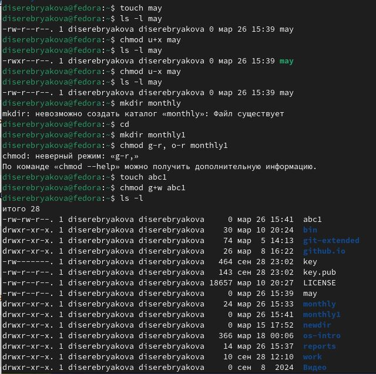
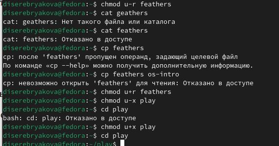

---
## Front matter
title: "Лабораторная работа №7"
subtitle: "Операционные системы"
author: "Серебрякова Дарья Ильинична"

## Generic otions
lang: ru-RU
toc-title: "Содержание"

## Bibliography
bibliography: bib/cite.bib
csl: pandoc/csl/gost-r-7-0-5-2008-numeric.csl

## Pdf output format
toc: true # Table of contents
toc-depth: 2
lof: true # List of figures
lot: true # List of tables
fontsize: 12pt
linestretch: 1.5
papersize: a4
documentclass: scrreprt
## I18n polyglossia
polyglossia-lang:
  name: russian
  options:
	- spelling=modern
	- babelshorthands=true
polyglossia-otherlangs:
  name: english
## I18n babel
babel-lang: russian
babel-otherlangs: english
## Fonts
mainfont: IBM Plex Serif
romanfont: IBM Plex Serif
sansfont: IBM Plex Sans
monofont: IBM Plex Mono
mathfont: STIX Two Math
mainfontoptions: Ligatures=Common,Ligatures=TeX,Scale=0.94
romanfontoptions: Ligatures=Common,Ligatures=TeX,Scale=0.94
sansfontoptions: Ligatures=Common,Ligatures=TeX,Scale=MatchLowercase,Scale=0.94
monofontoptions: Scale=MatchLowercase,Scale=0.94,FakeStretch=0.9
mathfontoptions:
## Biblatex
biblatex: true
biblio-style: "gost-numeric"
biblatexoptions:
  - parentracker=true
  - backend=biber
  - hyperref=auto
  - language=auto
  - autolang=other*
  - citestyle=gost-numeric
## Pandoc-crossref LaTeX customization
figureTitle: "Рис."
tableTitle: "Таблица"
listingTitle: "Листинг"
lofTitle: "Список иллюстраций"
lotTitle: "Список таблиц"
lolTitle: "Листинги"
## Misc options
indent: true
header-includes:
  - \usepackage{indentfirst}
  - \usepackage{float} # keep figures where there are in the text
  - \floatplacement{figure}{H} # keep figures where there are in the text
---

# Цель работы

Ознакомление с файловой системой Linux, её структурой, именами и содержанием
каталогов. Приобретение практических навыков по применению команд для работы
с файлами и каталогами, по управлению процессами (и работами), по проверке использования диска и обслуживанию файловой системы.

# Задания

1. Выполнить все примеры, приведённые в первой части описания лабораторной работы
2. Выполнить предложенные действия, связанные с переименованиемЮ копированием и перемещением файлов и каталогов
3. Определить опции команды chmod
4. Прочитать man по командам mount, fsck, mkfs, kill и кратко их охарактеризовать,
приведя примеры

# Выполнение лабораторной работы

Выполняю все примеры, приведенные в первой части лабораторной работы (рис. [-@fig:001]).

{#fig:001 width=70%}

Продолжаю выполнение примеров (рис. [-@fig:002]).

{#fig:002 width=70%}

Проверяю, есть ли необходимый мне файл /usr/include/sys/io.h (рис. [-@fig:003]).

{#fig:003 width=70%}

Копирую файл io.h в домашний каталог и называю его equipment, а также перемещаю файл equipment в каталог ~/ski.plases (рис. [-@fig:004]).

{#fig:004 width=70%}

Создаю в домашнем каталоге файл abc1 и копирую его в каталог ~/ski.plases, называя его equiplist2. Создаю каталог с именем equipment в каталоге ~/ski.plases. Перемещаю файлы equiplist и equiplist2 в каталог ~/ski.plases/equipment (рис. [-@fig:005]).

{#fig:005 width=70%}

Создаю и перемещаю каталог ~/newdir в каталог ~/ski.plases и называю его plans (рис. [-@fig:006]).

{#fig:006 width=70%}

Изменяю права доступа некоторым файлам (рис. [-@fig:007]).

{#fig:007 width=70%}

Пробую просмотреть содержимое файла /etc/password (рис. [-@fig:008]).

{#fig:008 width=70%}

Копирую файл ~/feathers в файл ~/file.old. Перемещаю файл ~/file.old в каталог ~/play. Копирую каталог ~/play в каталог ~/fun и перемещаю каталог ~/fun в каталог ~/play, назвав  его games (рис. [-@fig:010]).

{#fig:010 width=70%}

ДПредоставляю владельцу файла ~/feathers право на чтение. Лишаю владельца каталога ~/play права на выполнение. Пробую перейти в каталог ~/play. Предоставляю владельцу каталога ~/play право на выполнение (рис. [-@fig:011]).

{#fig:011 width=70%}

Читаю man по командам mount, fsck, mkfs, kill  (рис. [-@fig:012]).

{#fig:012 width=70%}

# Контрольные вопросы

1. Дайте характеристику каждой файловой системе, существующей на жёстком диске компьютера, на котором вы выполняли лабораторную работу. Ext2, Ext3, Ext4 или Extended Filesystem - это стандартная файловая система для Linux. Она была разработана еще для Minix. Она самая стабильная из всех существующих, кодовая база изменяется очень редко и эта файловая система содержит больше всего функций. Версия ext2 была разработана уже именно для Linux и получила много улучшений. В 2001 году вышла ext3, которая добавила еще больше стабильности благодаря использованию журналирования. В 2006 была выпущена версия ext4, которая используется во всех дистрибутивах Linux до сегодняшнего дня. В ней было внесено много улучшений, в том числе увеличен максимальный размер раздела до одного экзабайта.

NTFS — это файловая система по умолчанию, используемая операционными системами на базе Windows NT, начиная с 1993 года с Windows NT 3.1 и вплоть до Windows 11 включительно. Она предлагает расширенные функции, такие как права доступа к файлам, шифрование, сжатие и ведение журнала.

2. Приведите общую структуру файловой системы и дайте характеристику каждой директории первого уровня этой структуры.

/ — root каталог. Содержит в себе всю иерархию системы;

/bin — здесь находятся двоичные исполняемые файлы. Основные общие команды, хранящиеся отдельно от других программ в системе (прим.: pwd, ls, cat, ps);

/boot — тут расположены файлы, используемые для загрузки системы (образ initrd, ядро vmlinuz);

/dev — в данной директории располагаются файлы устройств (драйверов). С помощью этих файлов можно взаимодействовать с устройствами. К примеру, если это жесткий диск, можно подключить его к файловой системе. В файл принтера же можно написать напрямую и отправить задание на печать;

/etc — в этой директории находятся файлы конфигураций программ. Эти файлы позволяют настраивать системы, сервисы, скрипты системных демонов;

/home — каталог, аналогичный каталогу Users в Windows. Содержит домашние каталоги учетных записей пользователей (кроме root). При создании нового пользователя здесь создается одноименный каталог с аналогичным именем и хранит личные файлы этого пользователя;

/lib — содержит системные библиотеки, с которыми работают программы и модули ядра;

/lost+found — содержит файлы, восстановленные после сбоя работы системы. Система проведет проверку после сбоя и найденные файлы можно будет посмотреть в данном каталоге;

/media — точка монтирования внешних носителей. Например, когда вы вставляете диск в дисковод, он будет автоматически смонтирован в директорию /media/cdrom;

/mnt — точка временного монтирования. Файловые системы подключаемых устройств обычно монтируются в этот каталог для временного использования;

/opt — тут расположены дополнительные (необязательные) приложения. Такие программы обычно не подчиняются принятой иерархии и хранят свои файлы в одном подкаталоге (бинарные, библиотеки, конфигурации);

/proc — содержит файлы, хранящие информацию о запущенных процессах и о состоянии ядра ОС;

/root — директория, которая содержит файлы и личные настройки суперпользователя;

/run — содержит файлы состояния приложений. Например, PID-файлы или UNIX-сокеты;

/sbin — аналогично /bin содержит бинарные файлы. Утилиты нужны для настройки и администрирования системы суперпользователем;

/srv — содержит файлы сервисов, предоставляемых сервером (прим. FTP или Apache HTTP);

/sys — содержит данные непосредственно о системе. Тут можно узнать информацию о ядре, драйверах и устройствах;

/tmp — содержит временные файлы. Данные файлы доступны всем пользователям на чтение и запись. Стоит отметить, что данный каталог очищается при перезагрузке;

/usr — содержит пользовательские приложения и утилиты второго уровня, используемые пользователями, а не системой. Содержимое доступно только для чтения (кроме root). Каталог имеет вторичную иерархию и похож на корневой;

/var — содержит переменные файлы. Имеет подкаталоги, отвечающие за отдельные переменные. Например, логи будут храниться в /var/log, кэш в /var/cache, очереди заданий в /var/spool/ и так далее.

3. Какая операция должна быть выполнена, чтобы содержимое некоторой файловой системы было доступно операционной системе? Монтирование тома.

4. Назовите основные причины нарушения целостности файловой системы. Как устранить повреждения файловой системы? Отсутствие синхронизации между образом файловой системы в памяти и ее данными на диске в случае аварийного останова может привести к появлению следующих ошибок:

Один блок адресуется несколькими mode (принадлежит нескольким файлам).

Блок помечен как свободный, но в то же время занят (на него ссылается onode).

Блок помечен как занятый, но в то же время свободен (ни один inode на него не ссылается).

Неправильное число ссылок в inode (недостаток или избыток ссылающихся записей в каталогах).

Несовпадение между размером файла и суммарным размером адресуемых inode блоков.

Недопустимые адресуемые блоки (например, расположенные за пределами файловой системы).

"Потерянные" файлы (правильные inode, на которые не ссылаются записи каталогов).

Недопустимые или неразмещенные номера inode в записях каталогов.

5. Как создаётся файловая система?

mkfs - позволяет создать файловую систему Linux.

6. Дайте характеристику командам для просмотра текстовых файлов.

Cat - выводит содержимое файла на стандартное устройство вывода

7. Приведите основные возможности команды cp в Linux.

Cp – копирует или перемещает директорию, файлы.

8. Приведите основные возможности команды mv в Linux.

Mv - переименовать или переместить файл или директорию

9. Что такое права доступа? Как они могут быть изменены?

Права доступа к файлу или каталогу можно изменить, воспользовавшись командой chmod. Сделать это может владелец файла (или каталога) или пользователь с правами администратора.

# Выводы

В ходе работы я ознакомилась с файловой системой Linux, её структурой, именами и содержанием
каталогов, приобрела практические навыки по применению команд для работы
с файлами и каталогами, по управлению процессами (и работами), по проверке использования диска и обслуживанию файловой системы

# Список литературы

1. Лабораторная работа 7
