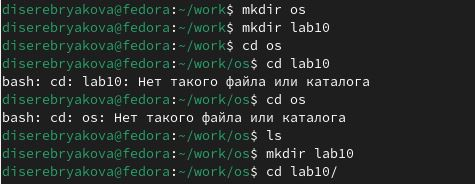
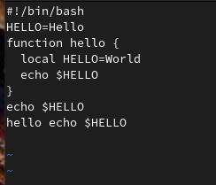

---
## Front matter
lang: ru-RU
title: Лабораторная работа 10
subtitle: Операционные системы
author:
  - Серебрякова Д. И.
institute:
  - Российский университет дружбы народов, Москва, Россия
date: 01 января 1970

## i18n babel
babel-lang: russian
babel-otherlangs: english

## Formatting pdf
toc: false
toc-title: Содержание
slide_level: 2
aspectratio: 169
section-titles: true
theme: metropolis
header-includes:
 - \metroset{progressbar=frametitle,sectionpage=progressbar,numbering=fraction}
---

## Цель работы

Познакомиться с операционной системой Linux. Получить практические навыки работы с редактором vi, установленным по умолчанию практически во всех дистрибутивах

## Задания

1. Создание нового файла с использованием vi
2. редактирование существующего файла

## Выполнение лабораторной работы

Создаю каталог с именем ~/work/os/lab10, перехожу в него, вызываю vi и создаю новый файл (рис. 1).

{#fig:001 width=70%}

## Выполнение лабораторной работы

Делаю файл исполняемым (рис. 2).

{#fig:002 width=70%}

## Выполнение лабораторной работы

Работаю с файлом, выполняя различные команды по добавлению и удалению текста. Сохраняю изменения и выхожу из редактора (рис. 3).

{#fig:003 width=70%}

## Выводы

В ходе выполнения работы я познакомилась с операционной системой Linux. Получила практические навыки работы с редактором vi, установленным по умолчанию практически во всех дистрибутивах

## Список литературы{.unnumbered}

1. Лабораторная работа 10
