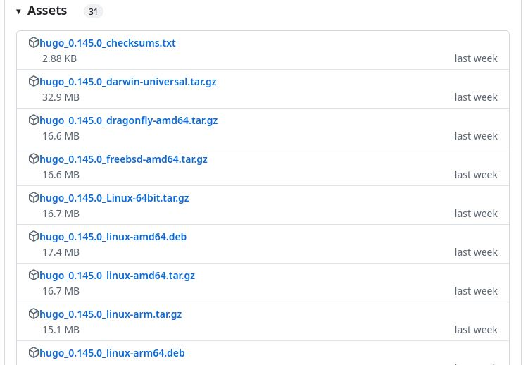
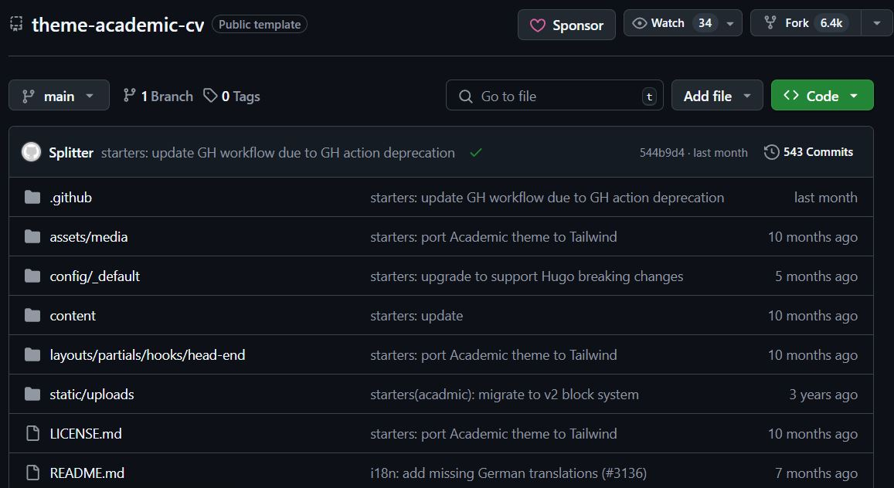
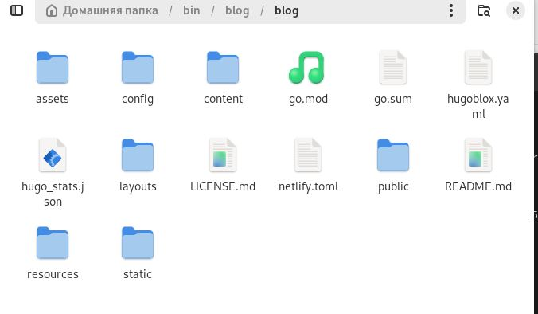
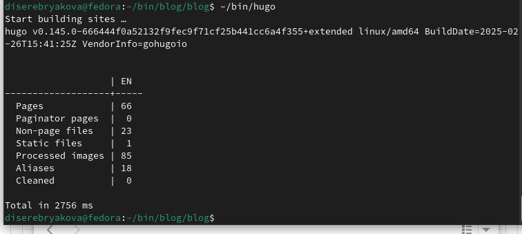
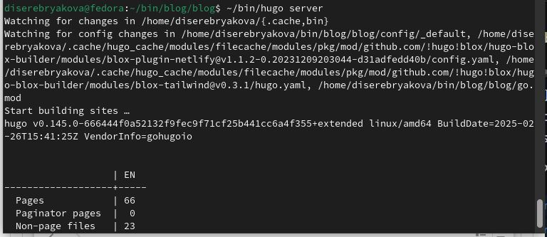
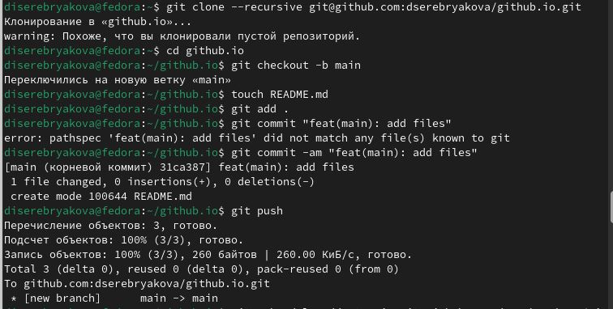
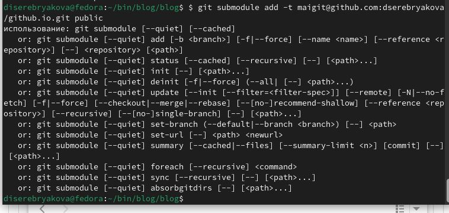
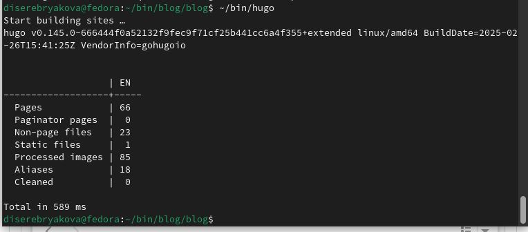
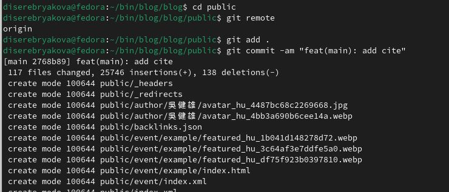

---
## Front matter
lang: ru-RU
title: Индивидуальный проект. Часть 1
subtitle: Операционные системы
author:
  - Серебрякова Д. И.
institute:
  - Российский университет дружбы народов, Москва, Россия
date: 8 марта 2025

## i18n babel
babel-lang: russian
babel-otherlangs: english

## Formatting pdf
toc: false
toc-title: Содержание
slide_level: 2
aspectratio: 169
section-titles: true
theme: metropolis
header-includes:
 - \metroset{progressbar=frametitle,sectionpage=progressbar,numbering=fraction}
---

# Цель работы

Научиться размещать сайт на github pages

# Задание

1. Установка необходимого ПО
2. Скачивание шаблона темы сайта
3. Размещение его на гитхаб

# Выполнение индивидуального проекта

## Установка необходимого ПО

Скачиваю последнюю версию исполняемого файла hugo для своей ОС (рис. 1).

{#fig:001 width=50%}

## Установка необходимого ПО

Распаковываю архив с исполняемым файлом (рис. 2).

{#fig:002 width=50%}

## Установка необходимого ПО

Создаю в домашнем каталоге папку бин, в нее перекладываю исполняемый файл хьюго (рис. 3).

{#fig:003 width=50%}

## Скачивание шаблона темы сайта

Создаю свой репозиторий под названием blog на основе шаблона Hugo blox (рис. 5).

{#fig:004 width=50%}

## Скачивание шаблона темы сайта

Клонирую созданный репозиторий к себе в локальный (рис. 5).

{#fig:005 width=50%}

## Размещение на хостинге гит

Запускаю исполняемый файл (рис. 6).

{#fig:006 width=50%}

## Размещение на хостинге гит

Запускаю исполняемый файл командой server (рис. 7).

{#fig:007 width=50%}

## Установка параметров для URL сайта

Создаю новый репозиторий и клонирую его. Создаю пустой файл и отправляю в репозиторий (рис. [-@fig:008]).

{#fig:008 width=50%}

## Установка параметров для URL сайта

Подключаю репозиторий к каталогу публик (рис. 9).

{#fig:009 width=50%}

## Установка параметров для URL сайта

Запускаю исполняемый файл (рис. 10).

{#fig:010 width=50%}

## Установка параметров для URL сайта

Отправляю все изменения в глобальный репозиторий (рис. 11).

{#fig:011 width=50%}

## Выводы

Научилась размещать сайт на github pages
