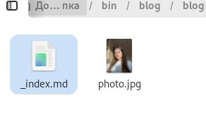
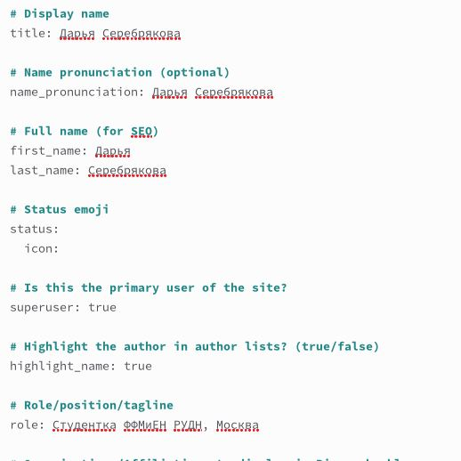
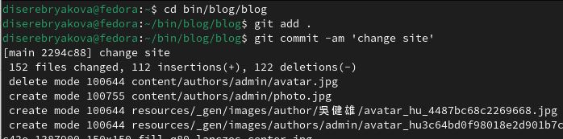
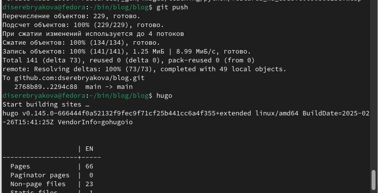
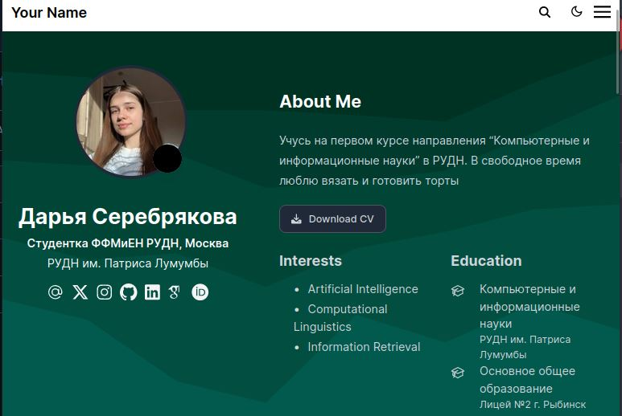
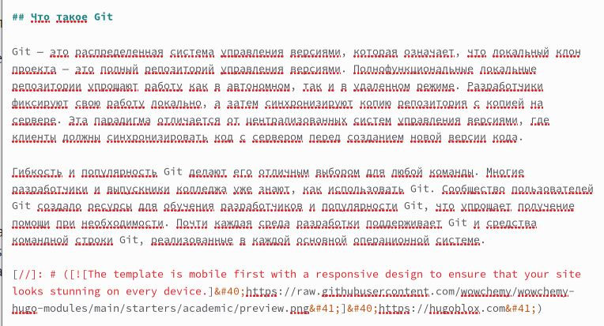
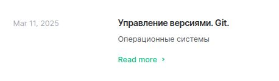
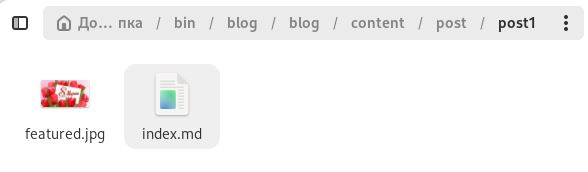

---
## Front matter
lang: ru-RU
title: Индивидуальный проект. Часть 2
subtitle: Операционные системы
author:
  - Серебрякова Д. И.
institute:
  - Российский университет дружбы народов, Москва, Россия
date: 12 марта 2025

## i18n babel
babel-lang: russian
babel-otherlangs: english

## Formatting pdf
toc: false
toc-title: Содержание
slide_level: 2
aspectratio: 169
section-titles: true
theme: metropolis
header-includes:
 - \metroset{progressbar=frametitle,sectionpage=progressbar,numbering=fraction}
---

## Цель работы

Продолжение освоения создания сайта

## Задания

1. Разместить фотографию владельца сайта.
2. Разместить краткое описание владельца сайта (Biography).
3. Добавить информацию об интересах (Interests).
4. Добавить информацию от образовании (Education).
5. Сделать пост по прошедшей неделе.
6. Добавить пост на тему "Управление версиями. Git"

# Выполнение проекта

## Выполнение проекта

Добавляю в нужный каталог свою фотографию для аватарки сайта (рис. 1).

{#fig:001 width=70%}

## Выполнение проекта

В файле index.md заполняю данные о себе, добавляю данные об интересах и образовании (рис. 2).

{#fig:002 width=70%}

## Выполнение проекта

Отправила изменения на глобавльный репозиторий (рис. 3).

{#fig:003 width=70%}

## Выполнение проекта

Запускаю создание сайта и открываю его (рис. 4).

{#fig:004 width=70%}

## Выполнение проекта

Просматриваю созданный сайт (рис. 5).

{#fig:005 width=70%}

## Выполнение проекта

Пишу пост на одну из тем по выбору (рис. 6).

{#fig:006 width=70%}

## Выполнение проекта

Пост написан и отобразился на моем сайте (рис. 7).

{#fig:007 width=70%}

## Выполнение проекта

Пишу пост о прошедшей неделе и добавляю к нему картинку (рис. 8).

{#fig:008 width=70%}

## Выполнение проекта

Проверяю, что пост отобразился на сайте (рис. 9).

{#fig:009 width=70%}

## Выполнение проекта

Задания выполнены

## Выводы

Получила новые навыки создания и редактирования своего сайта

