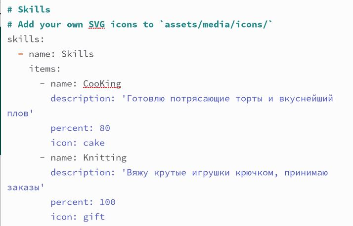
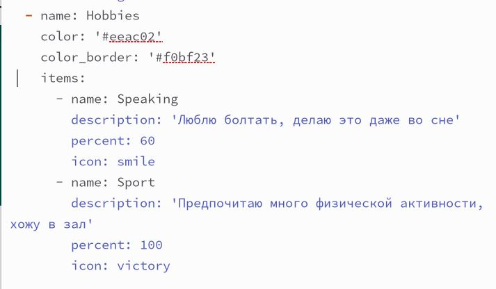
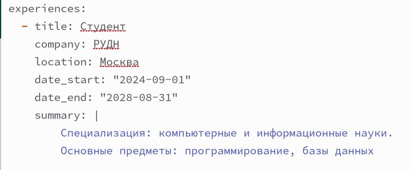
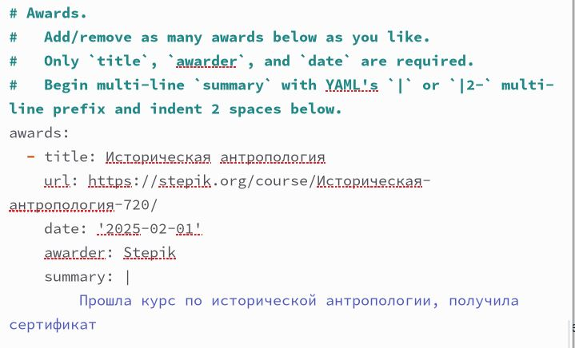
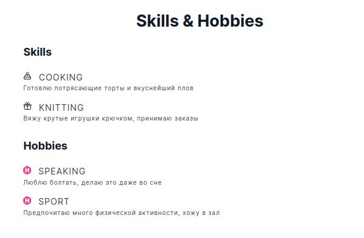
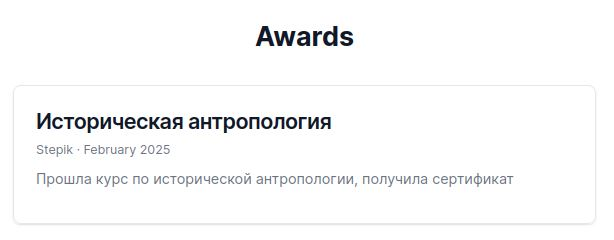
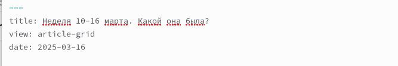
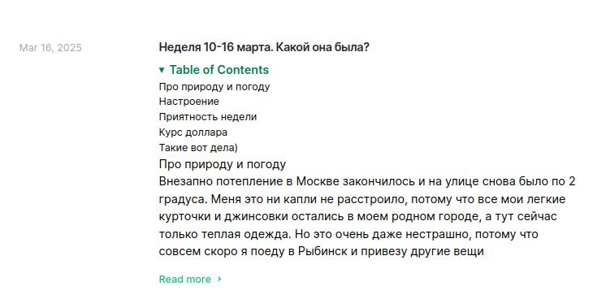
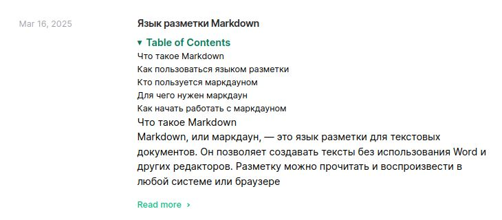

---
## Front matter
lang: ru-RU
title: Индивидуальный проект. Часть 3
subtitle: Операционные системы
author:
  - Серебрякова Д. И.
institute:
  - Российский университет дружбы народов, Москва, Россия
date: 16 марта 2025

## i18n babel
babel-lang: russian
babel-otherlangs: english

## Formatting pdf
toc: false
toc-title: Содержание
slide_level: 2
aspectratio: 169
section-titles: true
theme: metropolis
header-includes:
 - \metroset{progressbar=frametitle,sectionpage=progressbar,numbering=fraction}
---

## Цель работы

Выполнить очередной этап по созданию собственного сойта

## Задания

1. Добавить список достижений
2. Сделать пост по прошедшей неделе
3. Добавить пост на тему по выбору

## Выполнение индивидуального проекта

Добавляю в файле index.md (об авторе) информацию о навыках (рис. 1).

{#fig:001 width=50%}

## Выполнение индивидуального проекта

Добавила информацию о своих хобби (рис. 2).

{#fig:002 width=50%}

## Выполнение индивидуального проекта

Добавила информацию про мой опыт (рис. 3).

{#fig:003 width=70%}

## Выполнение индивидуального проекта

Внесла информацию о достижениях (рис. 4).

{#fig:004 width=50%}

## Выполнение индивидуального проекта

Убедилась, что хобби и навыки отобразились на сайте (рис. 5).

{#fig:005 width=50%}

## Выполнение индивидуального проекта

Проверила, что достижения также появились на моем сайте (рис. 6).

{#fig:006 width=70%}

## Выполнение индивидуального проекта

Напиала пост о прошедшей неделе (рис. 7).

{#fig:007 width=70%}

## Выполнение индивидуального проекта

Просмотрела получившийся пост на сайте (рис. 8).

{#fig:008 width=50%}

## Выполнение индивидуального проекта

Написала мини-статью про язык разметки Маркдаун (рис. 9).

{#fig:009 width=70%}

## Вывод

Выполнила третий этап проекта - дополнила свой личный сайт информацией и выложила 2 поста

# Спасибо за внимание

