---
## Front matter
lang: ru-RU
title: Индивидуальный проект. Часть 4
subtitle: Операционные системы
author:
  - Серебрякова Д. И.
institute:
  - Российский университет дружбы народов, Москва, Россия
date: 17 марта 2025

## i18n babel
babel-lang: russian
babel-otherlangs: english

## Formatting pdf
toc: false
toc-title: Содержание
slide_level: 2
aspectratio: 169
section-titles: true
theme: metropolis
header-includes:
 - \metroset{progressbar=frametitle,sectionpage=progressbar,numbering=fraction}
---

## Цель работы

Усовершенствовать свой сайт, добавив новые посты и ссылки на научные ресурсы

## Задания

1. Зарегестрироваться на предложенных ресурсах, разместить их ссылки на сайте
2. Сделать пост по прошедшей неделе
3. Добавить пост на тему по выбору

## Выполнение индивидуального проекта

Начинаю регистрацию на предложенных ресурсах (рис. 1).

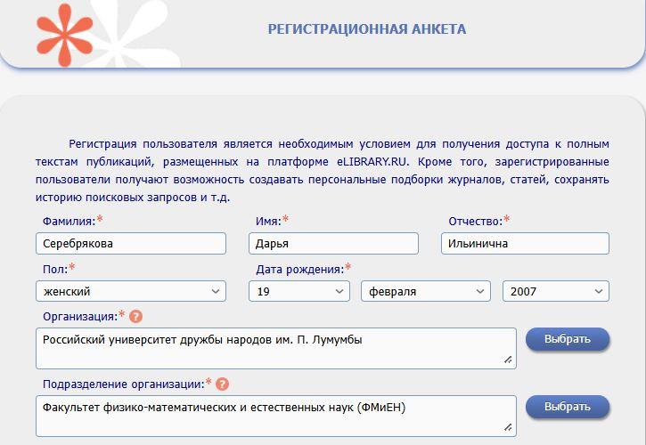{#fig:001 width=50%}

## Выполнение индивидуального проекта

Регистрируюсь на очередном сайте (рис. 2).

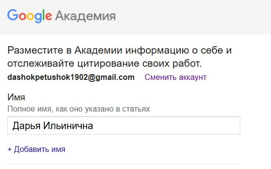{#fig:002 width=50%}

## Выполнение индивидуального проекта

Регистрируюсь на очередном сайте (рис. 3).

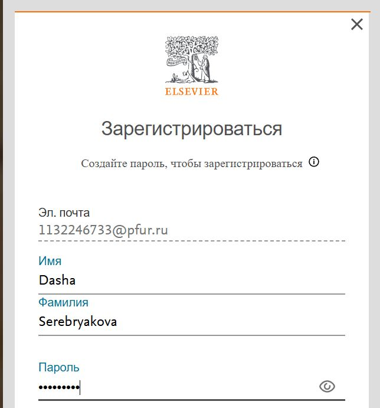{#fig:003 width=50%}

## Выполнение индивидуального проекта

Регистрируюсь на очередном сайте (рис. 4).

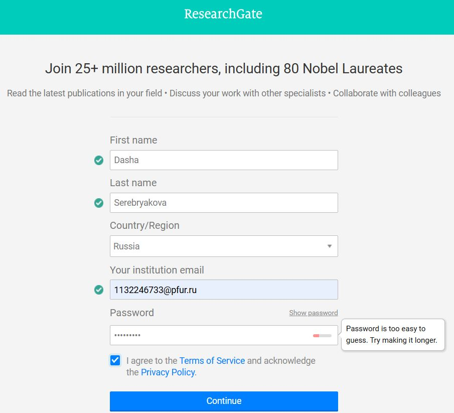{#fig:004 width=50%}

## Выполнение индивидуального проекта

Регистрируюсь на очередном сайте (рис. 5).

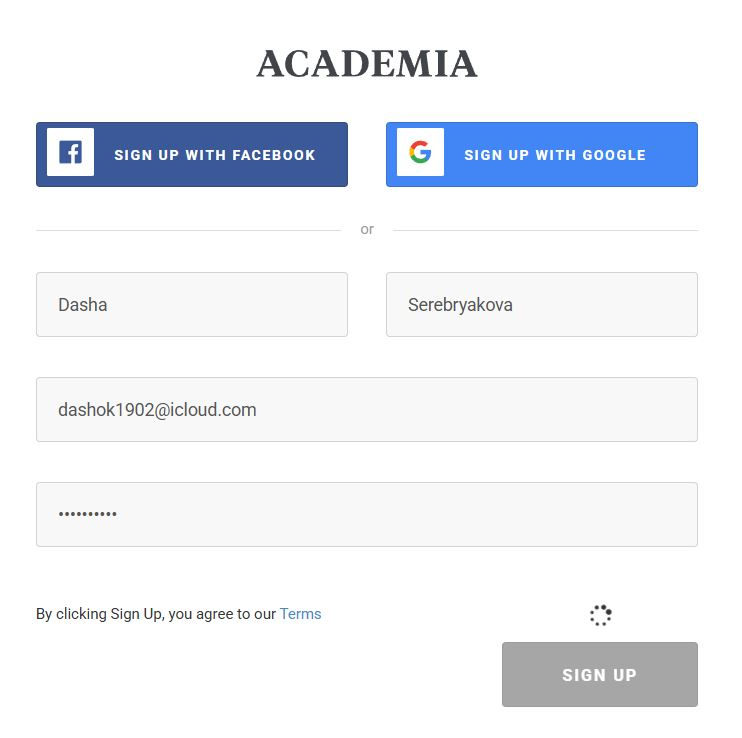{#fig:005 width=50%}

## Выполнение индивидуального проекта

Регистрируюсь на очередном сайте (рис. 6).

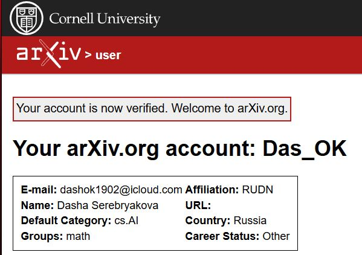{#fig:006 width=50%}

## Выполнение индивидуального проекта

Добавляю ссылки на ресурсы в файл index.md (рис. 7).

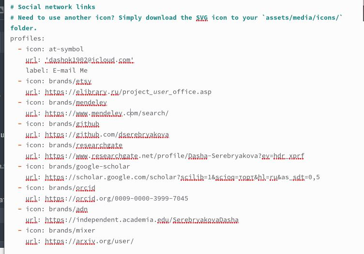{#fig:007 width=50%}

## Выполнение индивидуального проекта

Проверяю, что ссылки появились на сайте (рис. 8).

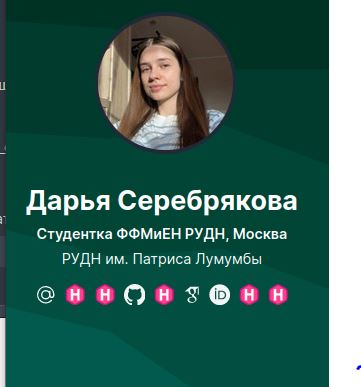{#fig:008 width=50%}

## Выполнение индивидуального проекта

Пишу пост о прошедшей неделе, добавляю к нему картинку и проверяю, что он появился на сайте (рис. 9).

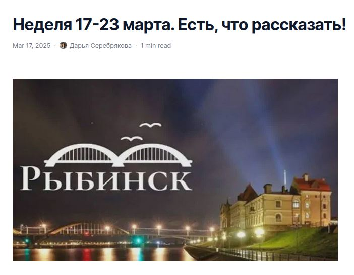{#fig:009 width=50%}

## Выполнение индивидуального проекта

Пишу пост на одну из выбранных тем: Оформление отчета (рис. 10).

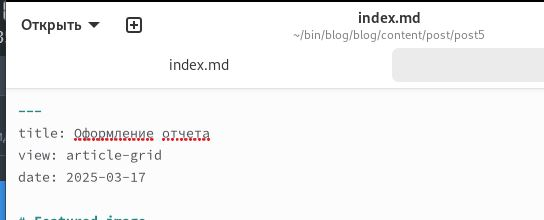{#fig:010 width=50%}

## Выполнение индивидуального проекта

Убеждаюсь, что пост появился на сайте (рис. 11).

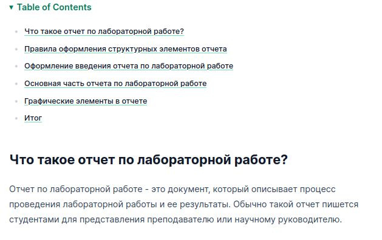{#fig:011 width=50%}

## Выводы

В ходе выполнения проекта я усовершенствовала свой сайт, добавив на него новые посты и ссылки на научные ресурсы

## Спасибо за внимание
